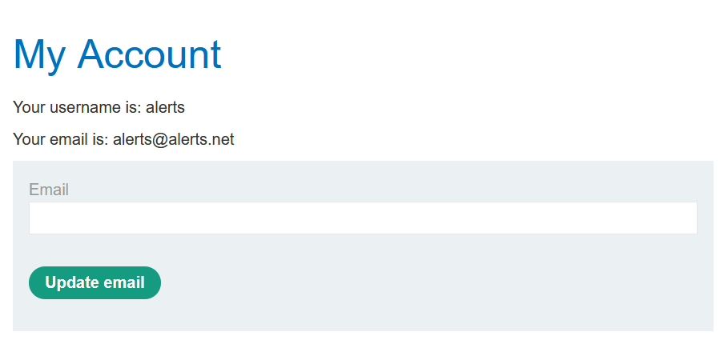

Table of contents
---
[toc]
# Brute-force attacks

Payloads:
- [Username]( https://portswigger.net/web-security/authentication/auth-lab-usernames)
- [Password](https://portswigger.net/web-security/authentication/auth-lab-passwords)


## Brute force usernames
Easy to guess by naming convention like,

- `firstname.lastname@corporation.com`
- `firstinitialname.lastname@corporation.com`

Notes for auditing:

- Is the website discloses a potential username publicly?
- Is a profile accessible without logging in?
- Contact email = potential IT support/sysadmin with high privileges.

## Brute-forcing passwords
Predictable password can improves success rate in brute force especially dictionary attack, therefore attackers may have an up to date wordlist.

## Username enumeration
Attackers may observe changes in the website before brute-forcing.

For examples, when attackers enter one username and a random password, the application might reply that the given username is valid but the password is incorrect.
Therefore, attackers can enumerate the valid usernames which then reduce the time cost required to do brute-force.

# Labs
## Lab #1: Username enumeration via different responses

Steps:

**BurpSuite Intruder - Sniper Attack**

Brute force username


Brute force password


Valid credential is `afiliados:123456789`


**Sniper Attack in Python**

Pseudo w/o threading:
Username enumeration
```
valid_users = []
for user in usernames:
	data = {
			"username": {user},
			"password": "test"}
	login = requests.post(url, data)
	
	if "Incorrect password" in login.text:
		valid_user.append(user)
		print(valid_user[-1]) 
```


## Lab #2: Username enumeration via subtly different responses

Steps:

Username enumeration


username `alerts` returns a response without full stop.

Brute force passwords




## Lab #3: Username enumeration via response timing

> My scripting skill is not strong enough to complete this lab, so I followed the solution.

Steps:

**Determine response time**

Invalid or valid username with valid password = around 1000ms


Valid username, invalid password = 4,900ms 


Brute-force with BurpSuite Intruder - Pitchfork attack

> By adding `X-Forwarded-For` header, the server will think our request was sent from proxy
>
> Example our client ip: 1.2.3.4 and `X-Forwarded-For` set to 127.0.0.1, then the server thinks the client ip, which is 1.2.3.4 was the proxy and believe the original request comming from 127.0.0.1, thus we can manipulate `X-Forwarded-For` to bypass brute-force ip blocking protection


Payload `X-Forwarded-For`


Payload `username`


User enumeration, select some user with high response time, and repeat the request using repeater
- arizona ~0,5s
- arkansas ~0,6s
- al ~0,5s
- ads ~0,5s
- appserver ~ 1s
- accounting ~ 0,5s


Brute force password


Done.

