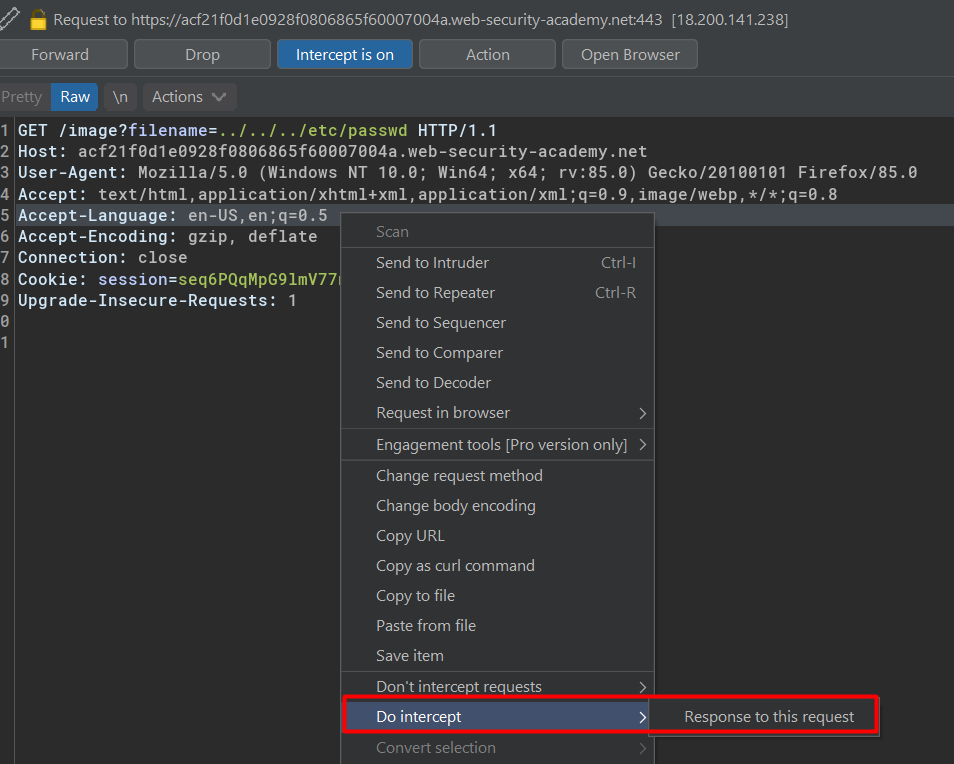

# Reading arbitrary files via directory traversal

## Lab #1: File path traversal, simple case

Example request url to fetch an image:
```
https://acf21f0d1e0928f0806865f60007004a.web-security-academy.net/image?filename=56.jpg
```

Intercept and modify



