# Common obstacles to exploiting file path traversal vulnerabilities

If an application block/strips traversal sequences, it might be possible to bypass it using the following techniques.

## Lab: File path traversal, traversal sequences blocked with absolute path bypass


Example request url to fetch images
```
https://acf21f0d1e0928f0806865f60007004a.web-security-academy.net/image?filename=73.jpg
```

Original request

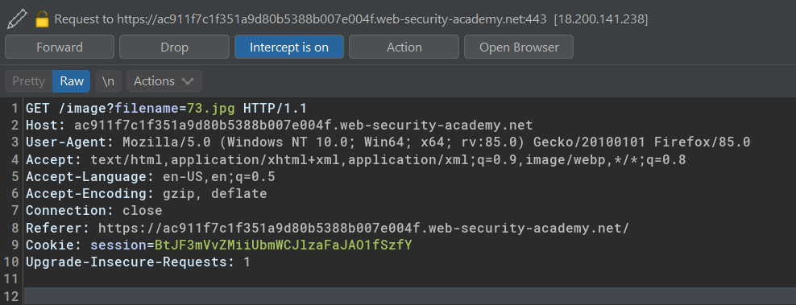

Modified request & intercept response

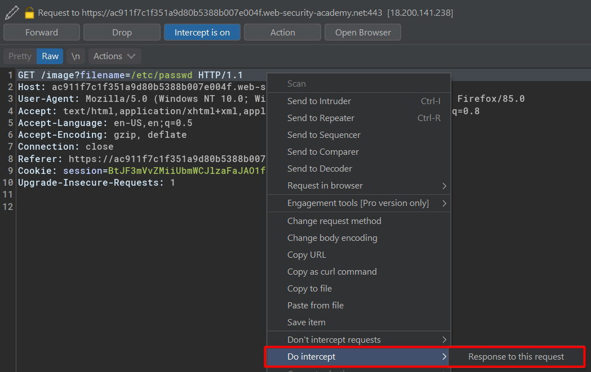

Intercepted response

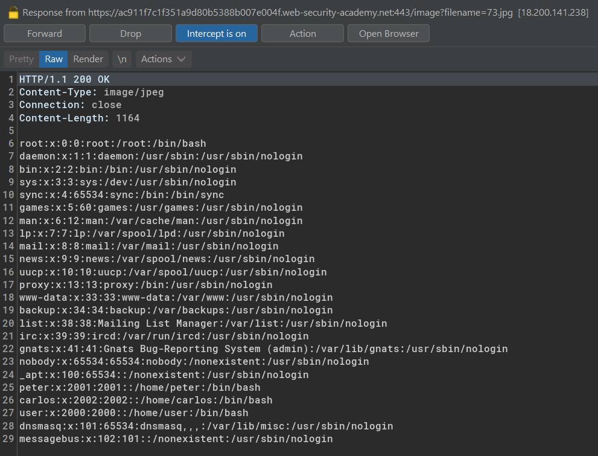


## Lab: File path traversal, traversal sequences stripped non-recursively

If the application filter/block a traversal sequences `../`, we can use the nested one `....//`, which will simply revert to `../`.

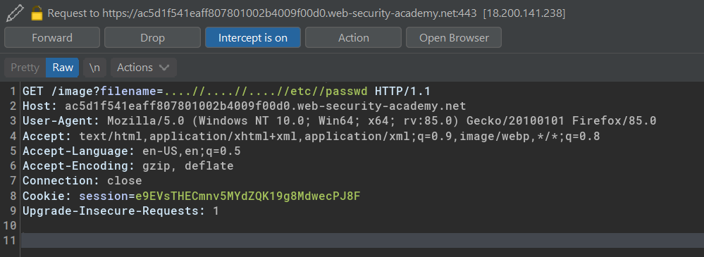

blocked pattern `../`  
blocked pattern stripped by the apps `..[../]/` => `../`

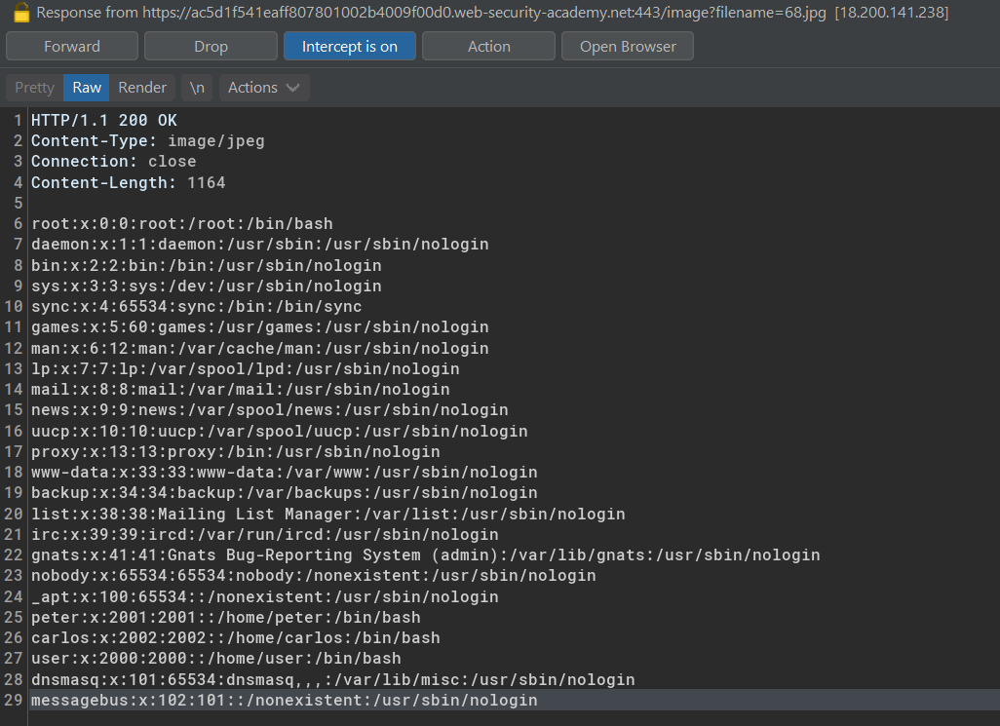

## Lab: File path traversal, traversal sequences stripped with superfluous URL-decode

Browser uses a url encode and decode like
`%20` for a space, `%40` for @. Therefore, a superflous decode might used to bypass an application input filter.

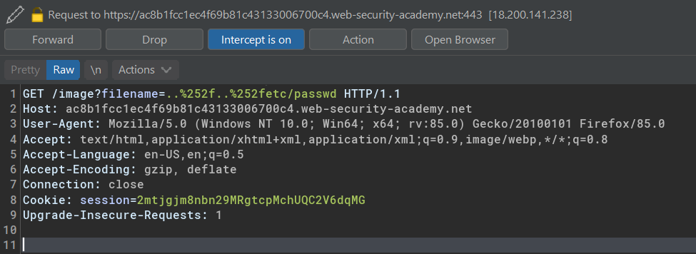


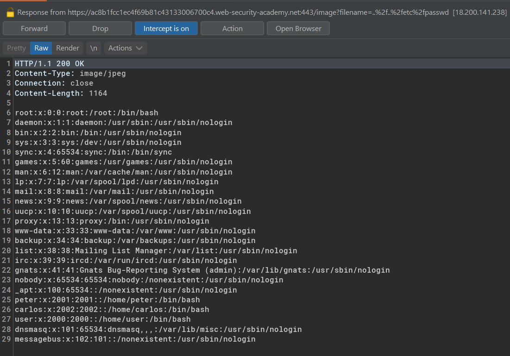

Superflous decode

- `%25` = `%`  
- `%2f` = `/`
- `%252f` = `%2f` => `/`

## Lab: File path traversal, validation of start of path

Example request url:

```
https://ac1e1f671f42243b800c1527000400e7.web-security-academy.net/image?filename=/var/www/images/5.jpg
```
It requires `/var/www/images/` as base path

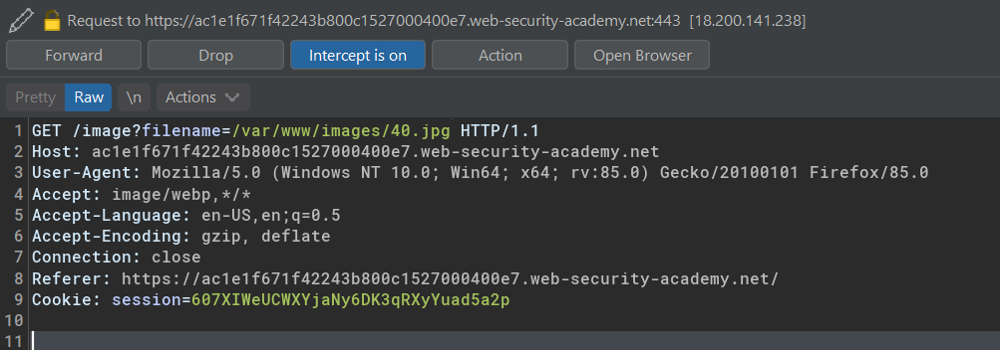

In this case, it might be possible to just traverse back with suitable techniques 

```
/var/www/images/./etc/passwd
/var/www/images/....//....//....//etc/passwd
/var/www/images/....%25f....%25f....%25fetc/passwd
```

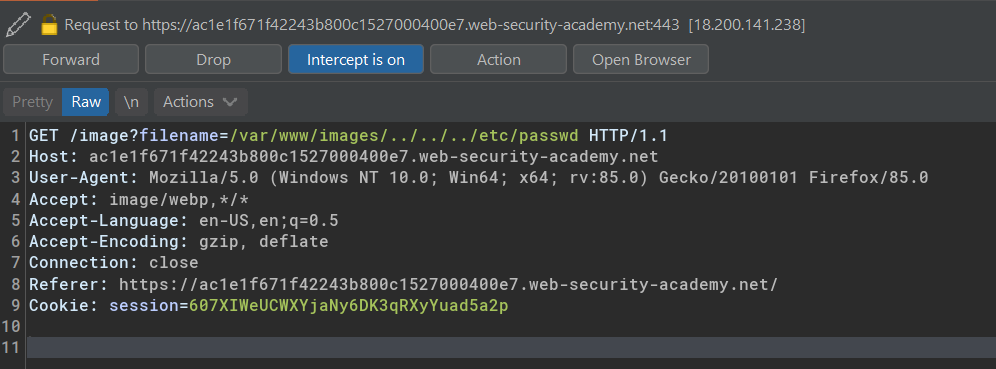

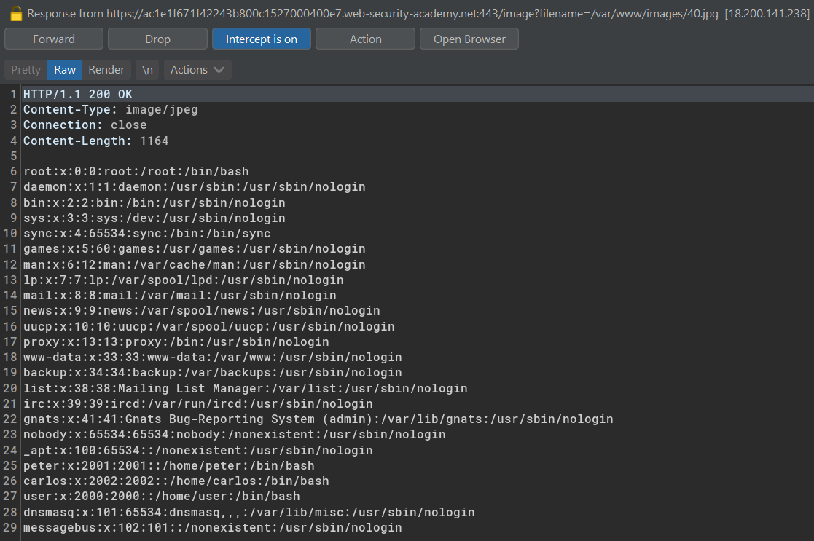


## Lab: File path traversal, validation of file extension with null byte bypass

If a specific file extension is expected by the app, then it might be possible to terminate the required extension by using null byte.

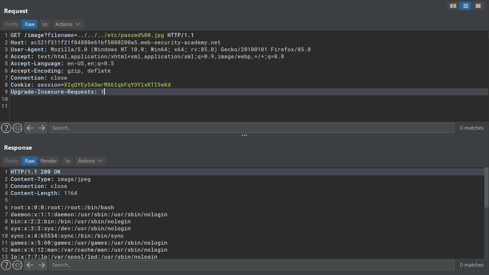