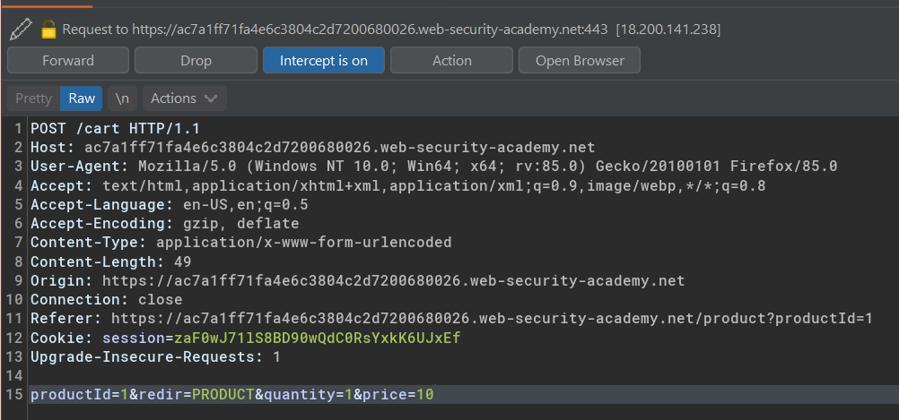
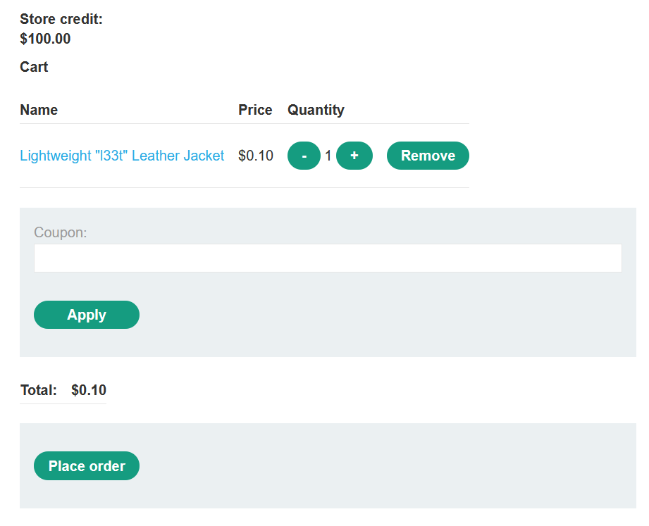
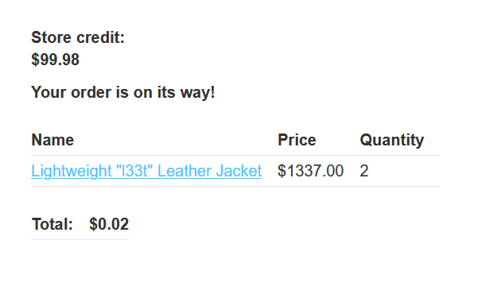
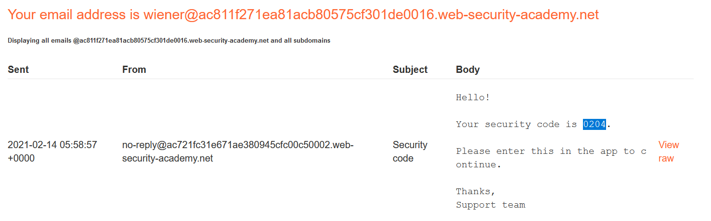
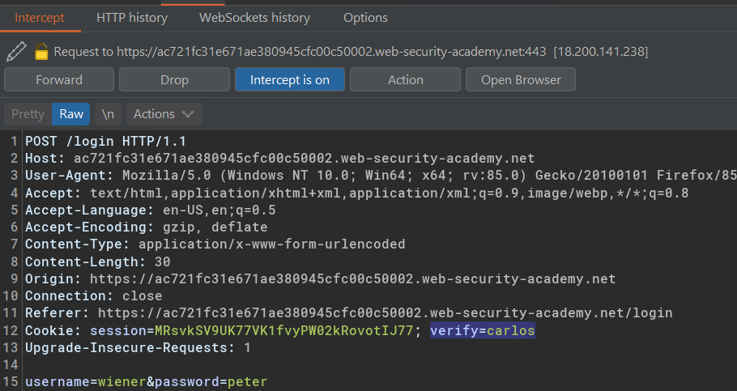
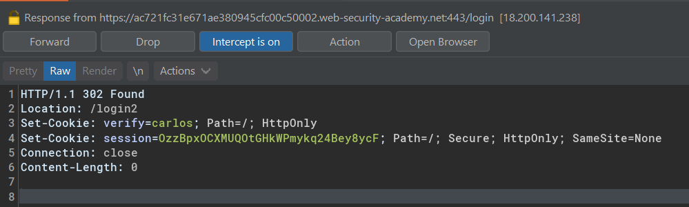
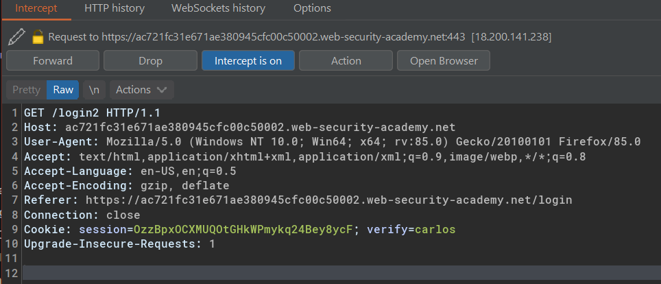
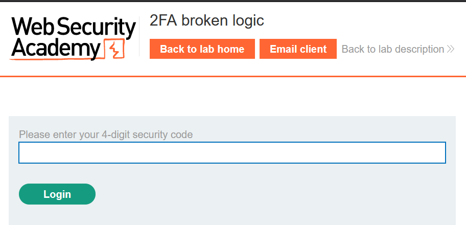
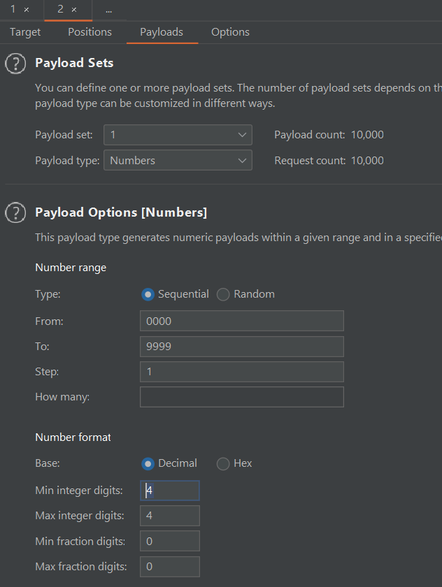

Table of contents
---
[toc]
# Excessive trust in client-side controls

## Lab #1: Excessive trust in client-side controls

Example case on e-commerce web apps:

Intercept request and manipulate product price before it enters the shopping cart

Later, in the shopping cart it's shown as only $0.10 in price.

When the original price is $1337

## Lab #2: 2FA broken logic

Your credentials: `wiener:peter`
Victim's username: `carlos`

Intercept login request as well as the request responses.

We could change the `verify` value to carlos for both request and response

Now it'll send a 4 digit verification into the carlos e-mail

With this attackers could brute force to guess the correct pin
(10.000 tries for all possible combination)

When we have the correct one, we'll logged in as carlos 