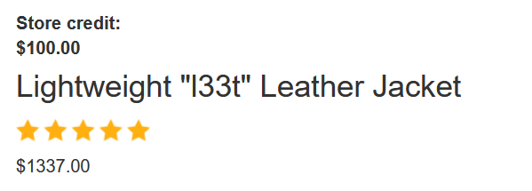
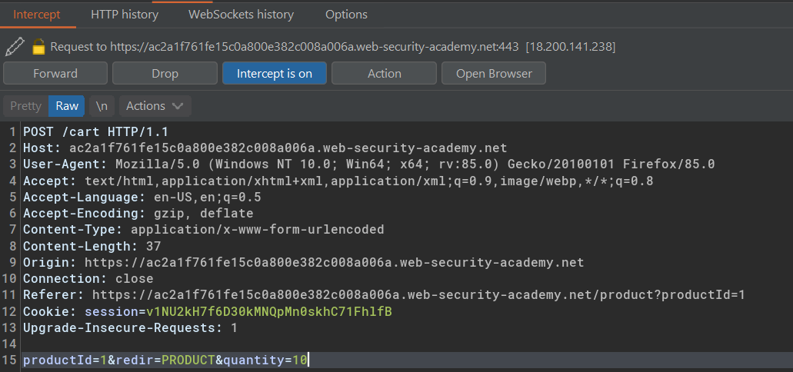
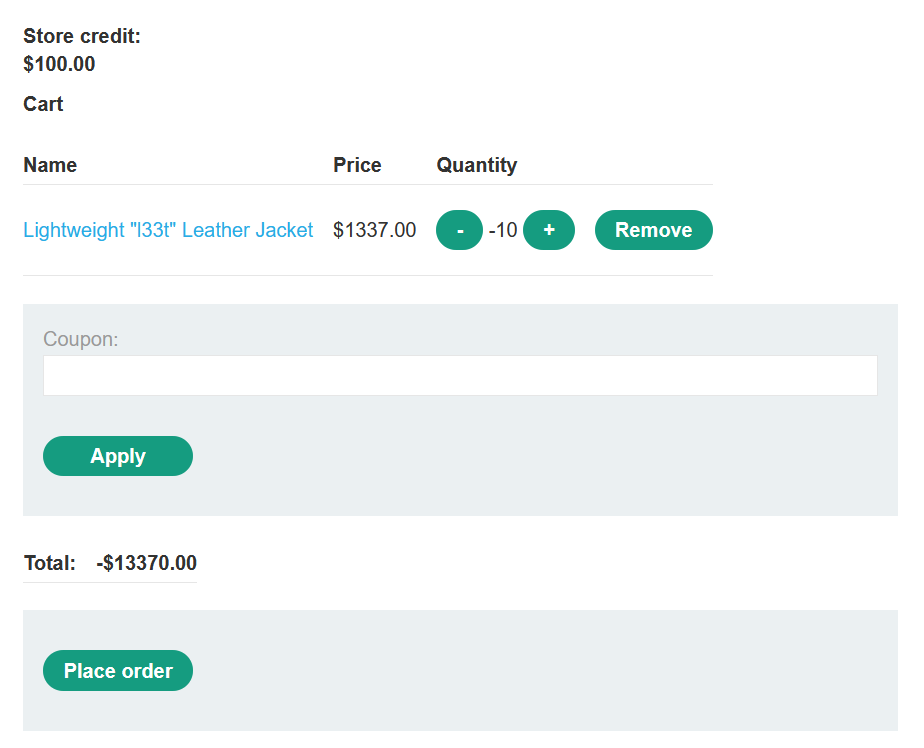
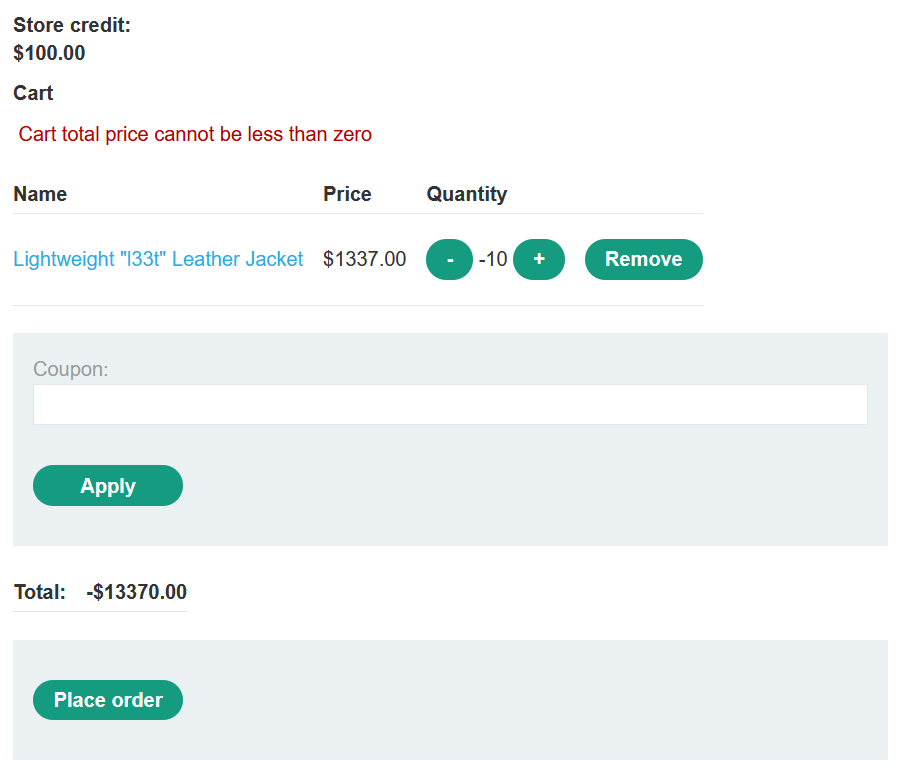
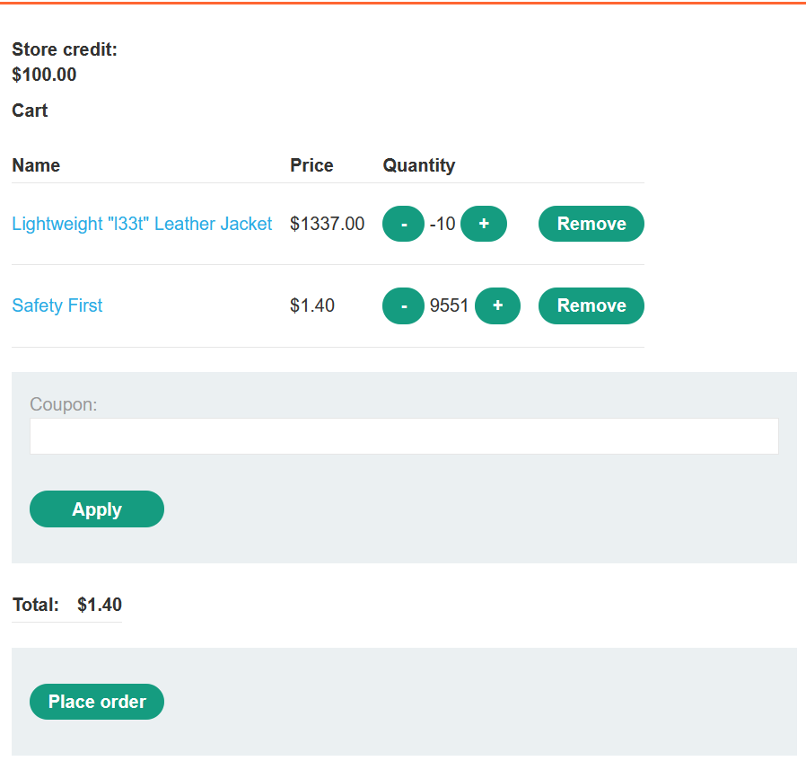
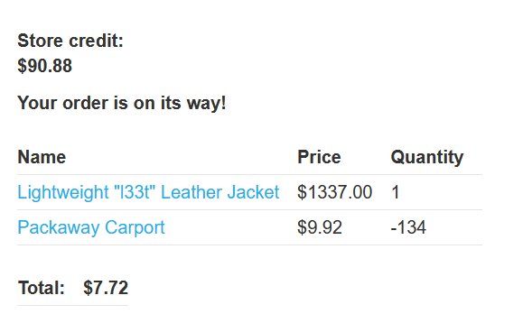

Table of contents
---
[toc]
# Failing to handle unconventional input

Example case:
```
$transferAmount = $_POST['amount'];
$currentBalance = $user->getBalance();

if ($transferAmount <= $currentBalance) {
    // Complete the transfer
} else {
    // Block the transfer: insufficient funds
}
``` 

Initial balance  
attackers : $1000
victim : $2000

attacker sent $1000  
$-1000 => victim balance's

victim's balance after receiving the transfer  
`$2000 + (-$1000) = $1000`

recalculate attacker's balance after transfer  
`$1000 - (-$1000) = $2000`

## Lab #3: High-level logic vulnerability

Credentials: `wiener:peter`  






Modify request body

```
productId=1&redir=PRODUCT&quantity=-10
```

Resulting the product quantity turn to `-10` in the shopping cart.



At this time, it states total price cannot be less than zero



Now, what if we add another items with normal price to cover the minus of the total price?



We can do the opposite as well.

