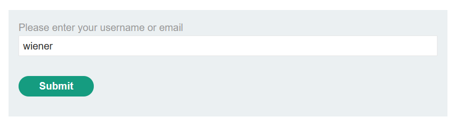

Table of contents
---
[toc]
# Making flawed assumptions about user behavior

## Lab #6: Inconsistent security controls

Complete registration proccess


Discover hidden content/directory with gobuster

```
$ gobuster.exe dir -u http://url -w wordlist
```


It states the admin interface is not accessible except for DontWannaCry user


An inconsistent security comes from here, where the registration does need an email verification but not for changing/updating email


## Lab #8: Password reset broken logic

> - Your credentials: wiener:peter
> - Victim's username: carlos

Use forgot password feature



Check the email client, open and intercept the link for password reset


Modify username in body request from `wiener` to `carlos`


Simply login as carlos and input `peter` for the password


Authenticated!


	
## Lab #9: 2FA simple bypass

Expected authentication flow:  
`Login => Send mail verification => Input verification code => Home page`

Unintended authentication flow:  
`Login => Home page`


Intercept the request and the response as well


By observing the HTTP status request, it might be possible that we're already authenticated before the app ask for verification code


If that's , we could just modify the response location to homepage/account page


Log in as carlos succeeded


