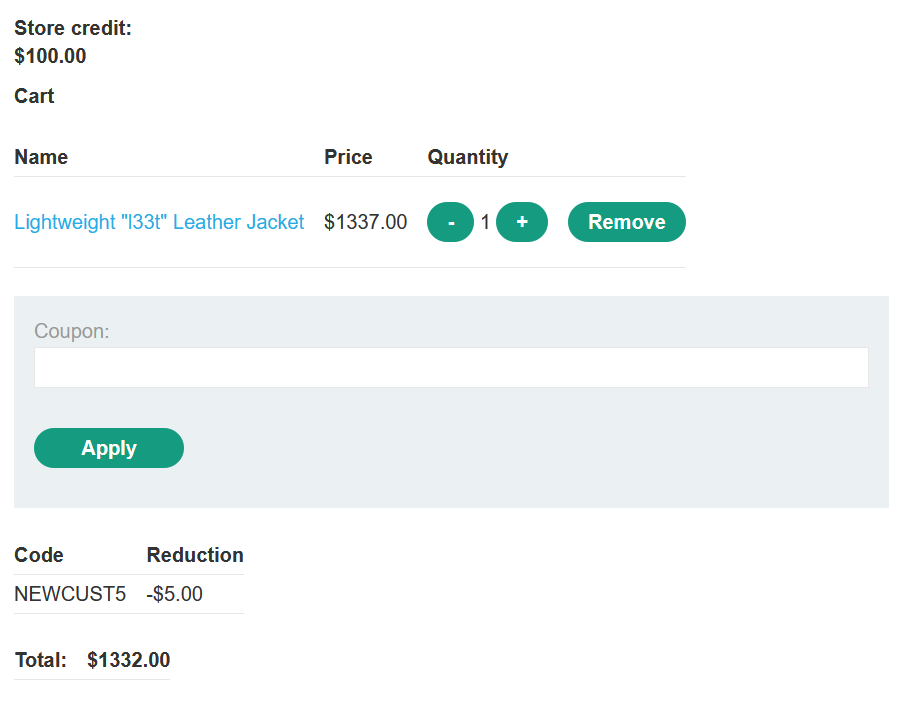
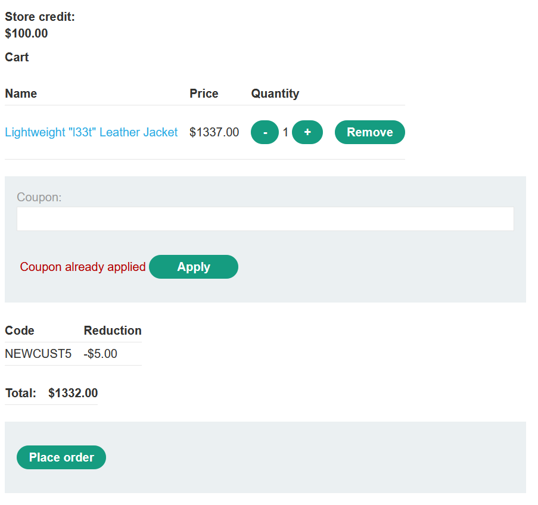
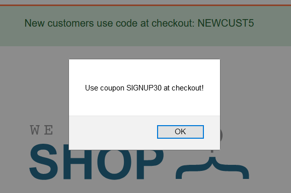
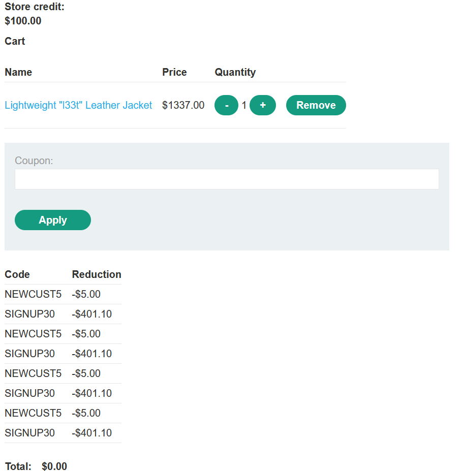
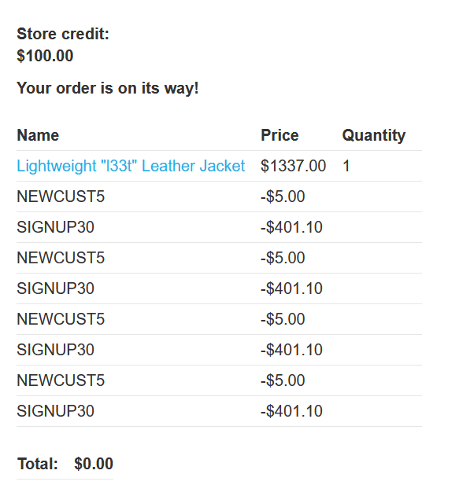

Table of contents
---
[toc]
# Domain-specific flaws

## Lab #12: Flawed enforcement of business rules

Credentials: `wiener:peter`

Normal order

We could use BurpSuite repeater to repeat the request on applying the coupon code to see if it can be stacked with the same coupon.

Since it cannot be stacked with the same coupon, let's try with another coupon.  

And repeat the use of different coupon alternately

It broke the application logic

