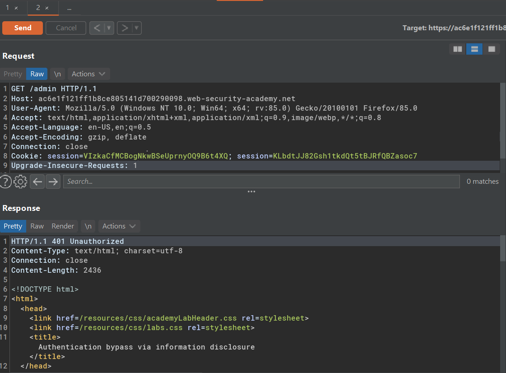

Table of contents
---
[toc]
# How to find and exploit information disclosure vulnerabilities

Common sources of information disclosure:

- Files for web crawlers
- Directory listings
- Developer comments 
- Error messages 
- Debugging data 
- User account pages 
- Backup files 
- Insecure configuration 
- Version control history 

## Lab #1: Information disclosure in error messages


Application version leak:  

`Apache Struts 2 2.3.31`

It has a public exploit 


## Lab #2: Information disclosure on debug page

Leaked hidden directory in html comment.


PHP version 


PHP Environment 


## Lab #3: Source code disclosure via backup files

Discovered a hidden directory called backup in `robots.txt` file

```
https://ac521f681f06832780d52e5e00130030.web-security-academy.net/robots.txt
```


Leaked DSN


## Lab #4: Authentication bypass via information disclosure

Request to admin page


Send TRACE request to admin


It reveals a headers (`X-Custom-IP-Authorization`) to determine if it's a local request or not


## Lab #5: Information disclosure in version control history


We could access git logs on `.git/logs/HEAD`

```
 <omitted> Carlos Montoya <carlos@evil-user.net> 1613992012 +0000	commit (initial): Add skeleton admin panel
 <omitted> Carlos Montoya <carlos@evil-user.net> 1613992012 +0000	commit: Remove admin password from config
```

Bulk download with `wget`


Checkout the earlier commit to restore admin.conf


