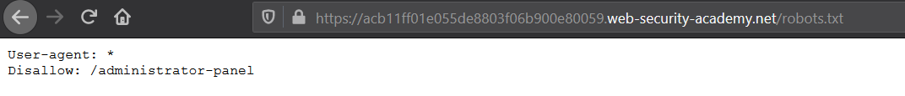
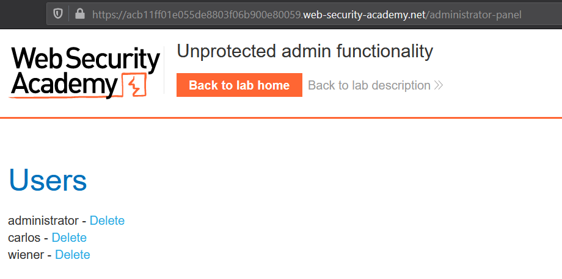
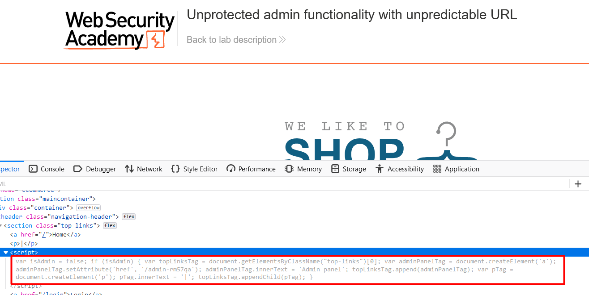
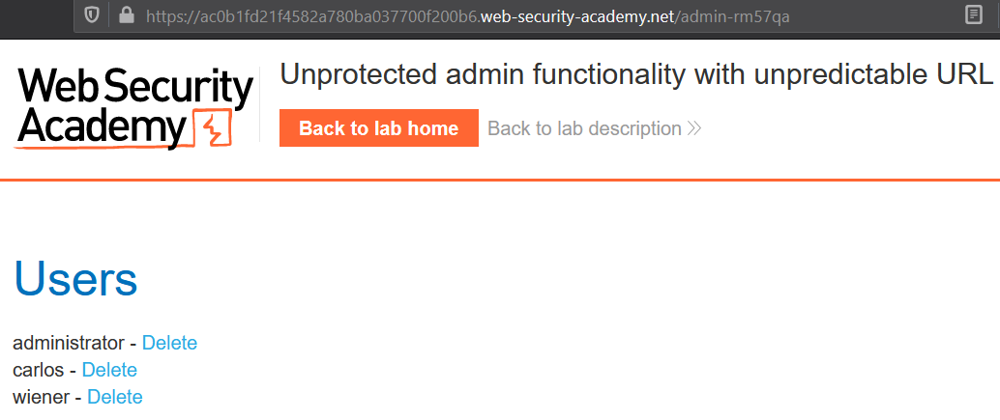

# Unprotected functionality 

Example of unprotected functionality:

## Lab #1: Unprotected admin functionality
> This lab has an unprotected admin panel. 

Leaked admin panel directory in `robots.txt` file  



Admin panel could be accessed without authentication, this leads to a vertical privilege escalation where an unauthorized user gain admin functionality.  



## Lab #2: Unprotected admin functionality with unpredictable URL

> This lab has an unprotected admin panel. It's located at an unpredictable location, but the location is disclosed somewhere in the application. 



Code:
 
```javascript
var isAdmin = false;
if (isAdmin) {
   var topLinksTag = document.getElementsByClassName("top-links")[0];
   var adminPanelTag = document.createElement('a');
   adminPanelTag.setAttribute('href', '/admin-rm57qa');
   adminPanelTag.innerText = 'Admin panel';
   topLinksTag.append(adminPanelTag);
   var pTag = document.createElement('p');
   pTag.innerText = '|';
   topLinksTag.appendChild(pTag);
}
```

Gained admin functionality


