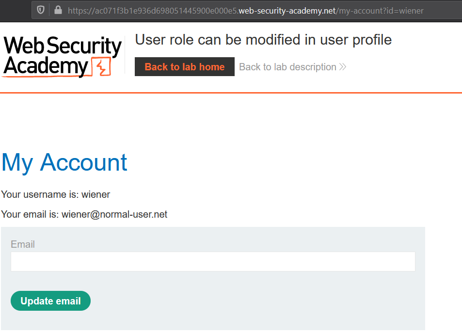

# Parameter-based access control methods

Some applications determine the user's access rights or role at login, and then store this information in a user-controllable location, such as a hidden field, cookie, or preset query string parameter

In some applications, user's access are stored in a user-controllable location:
- URL Parameter
- Cookie
- Hiddenfield

## Lab #3: User role controlled by request parameter

>  This lab has an admin panel at `/admin`, which identifies administrators using a forgeable cookie.
>
>Solve the lab by accessing the admin panel and using it to delete the user carlos.
>
>You have an account on the application that you can use to help design your attack. The credentials are: `wiener:peter`. 

`/admin` says:

However, there's a potential privilege escalation via cookie.

When the `admin` value is set to `True`, it gained admin functionality.

## Lab #4: User role can be modified in user profile
> This lab has an admin panel at /admin. It's only accessible to logged-in users with a roleid of 2.
>   
> Solve the lab by accessing the admin panel and using it to delete the user carlos.  
>  
> You can log in to your own account using wiener:peter. 

Simply visit the admin panel on `/admin`

Parameter id is available when visiting my-account, but the labs need a `roleid` in integer, not an `id` in string type.

When a request to update an email is sent, the returned response contains user roleid.

Now, we could sent a new request and add a 
`{"roleid": 2}`

The homepage displays the menu for accessing admin panel.

