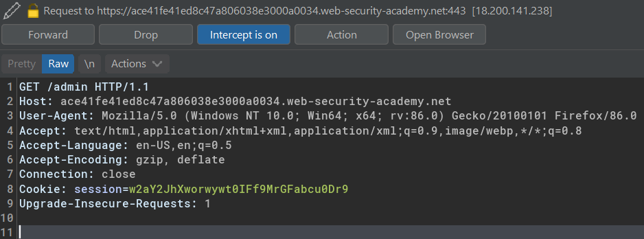
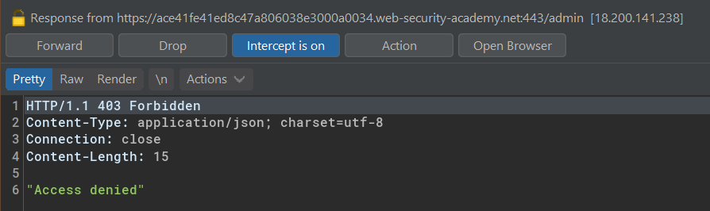
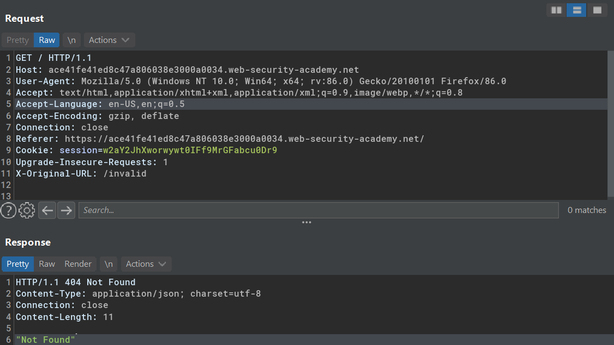
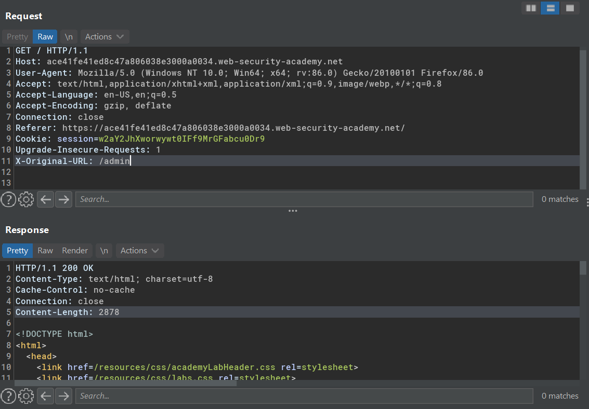
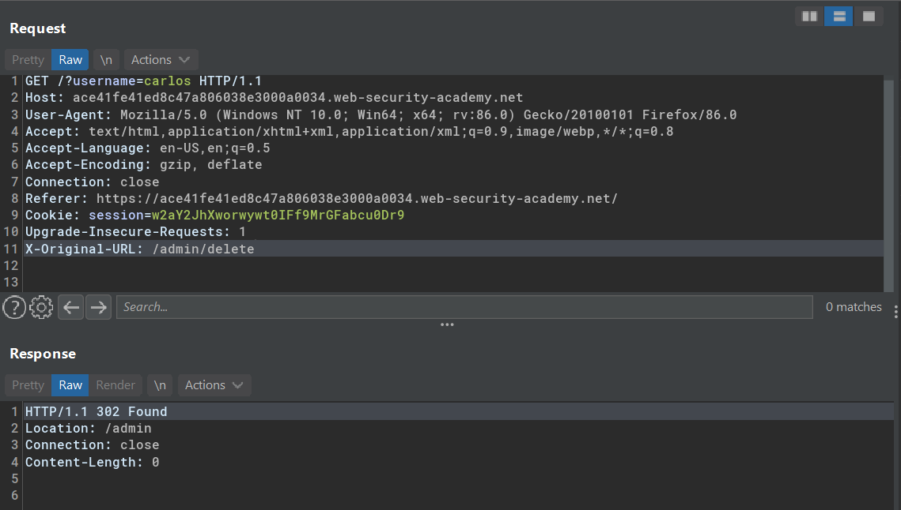
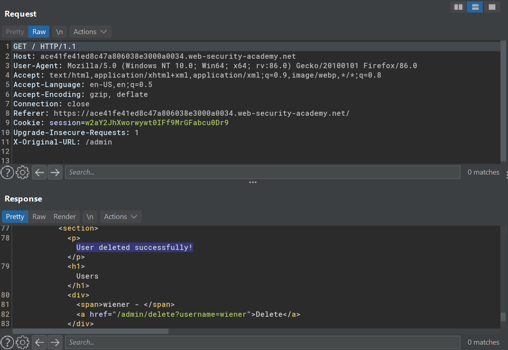
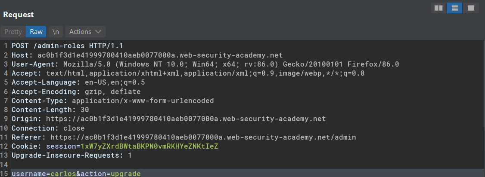
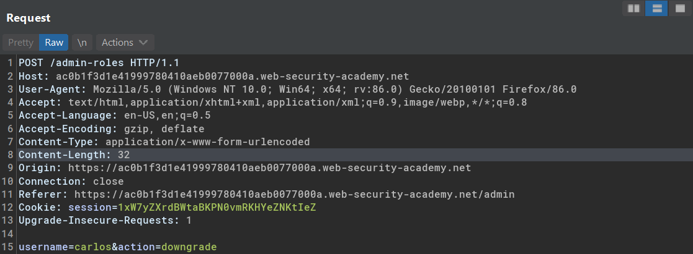
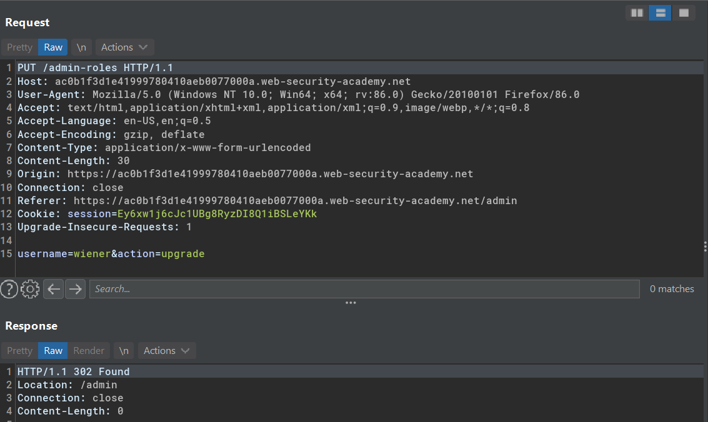
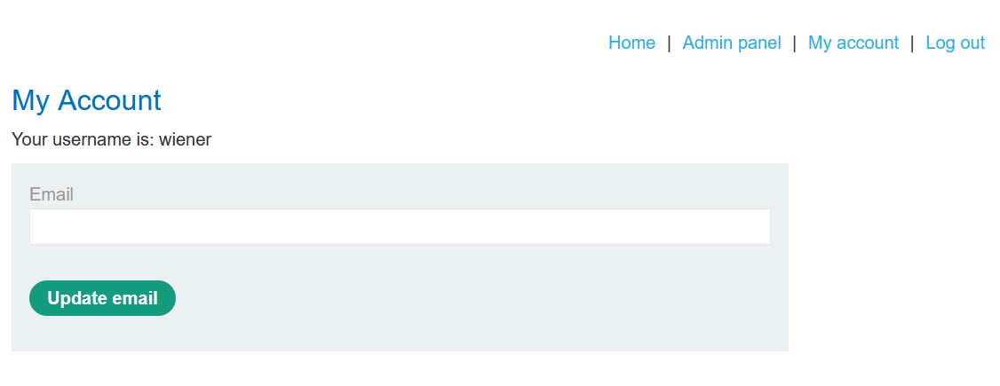

# Broken access control resulting from platform misconfiguration

Example of broken access control from platform misconfiguration is when a non-standard HTTP headers such as `X-Original-URL` and `X-Rewrite-URL` can be used to bypass restricted acccess of application URL/functions that has specific rules enforced to it.

## Lab #4: URL-based access control can be circumvented

> This website has an unauthenticated admin panel at `/admin`, but a front-end system has been configured to block external access to that path. However, the back-end application is built on a framework that supports the `X-Original-URL` header.
>
> To solve the lab, access the admin panel and delete the user carlos. 

Normal request to `/admin`

Testing custom HTTP header 

Override original request URL `GET / HTTP/1.1` with `X-Original-URL: /admin`

Sent delete request for user `carlos`

user `carlos` deleted successfully

## Lab #5: Method-based access control can be circumvented
>This lab implements access controls based partly on the HTTP method of requests. You can familiarize yourself with the admin panel by logging in using the credentials `administrator:admin`.
>
> To solve the lab, log in using the credentials `wiener:peter` and exploit the flawed access controls to promote yourself to become an administrator. 

Observing the application request as admin

Request action: promote user to admin

Request action: demote user from admin

Trying `PUT` as it's the proper method to update things in REST way

Now user `wiener` has admin panel

