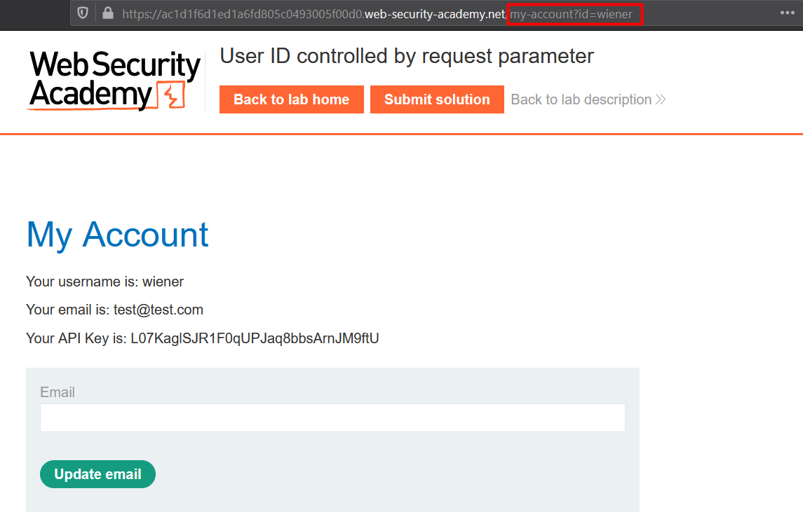
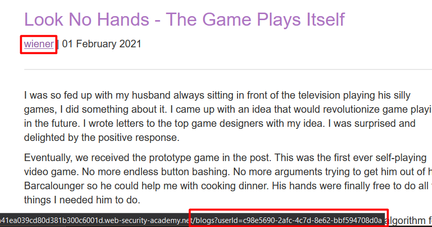
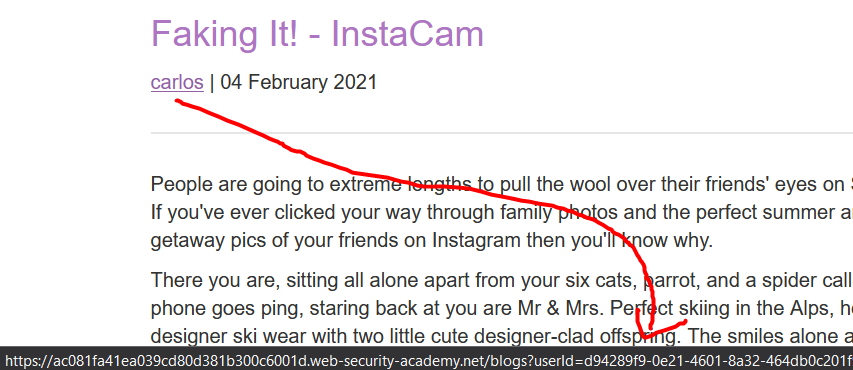
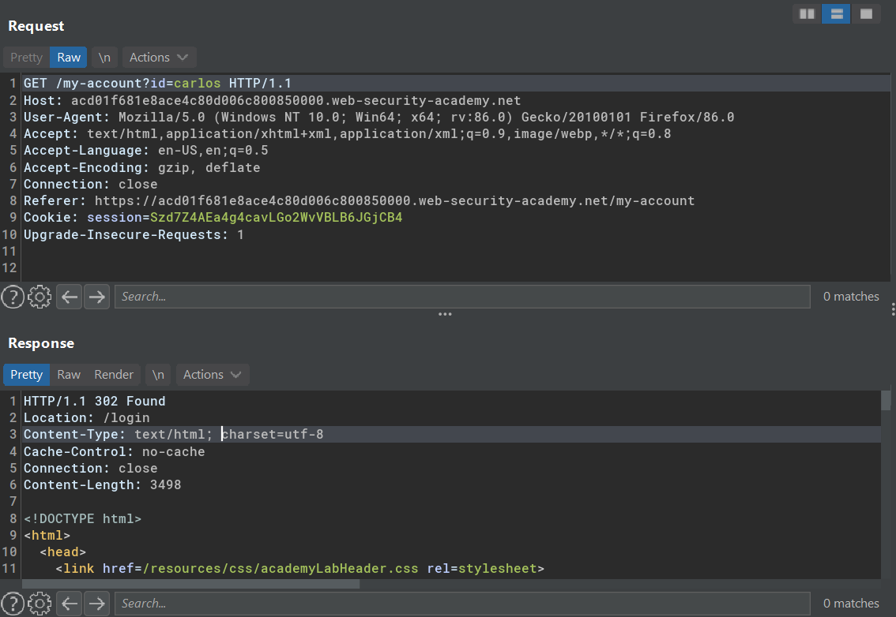
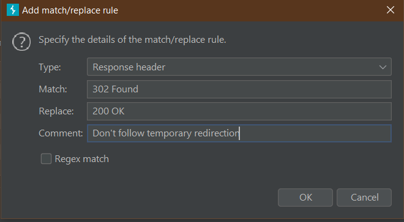
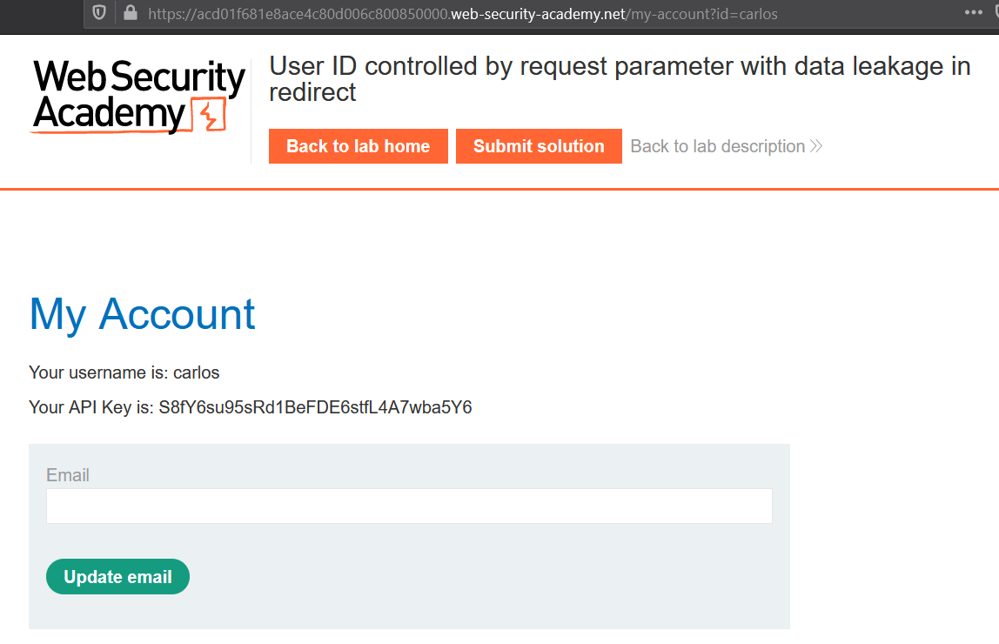

04. Horizontal privilege escalation

# Horizontal privilege escalation

A horizontal privilege escalation occurs when a user is able to gain/access another user resources.

## Lab #6: User ID controlled by request parameter 
> This lab has a horizontal privilege escalation vulnerability on the My Account page.
> 
> To solve the lab, obtain the API key for the user carlos and submit it as the solution.
>
> You can log in to your own account using the following credentials: `wiener:peter` 

Observe 'My account' URL

Change the request parameter to `id=carlos`

## Lab #7: User ID controlled by request parameter, with unpredictable user IDs 

>This lab has a horizontal privilege escalation vulnerability on the My Account page, but identifies users with GUIDs.
>
>To solve the lab, find the GUID for carlos, then submit his API key as the solution.
>
>You can log in to your own account using the following credentials: wiener:peter 

The post author's name is displayed in each post along with its GUID in the URL.

Carlos GUID found!

## Lab #8: User ID controlled by request parameter with data leakage in redirect 

> This lab contains an access control vulnerability where sensitive information is leaked in the body of a redirect response.
>
> To solve the lab, obtain the API key for the user carlos and submit it as the solution.
>
> You can log in to your own account using the following credentials: `wiener:peter `
  

The application is rendering its content before doing page redirection.

In this case, I could easily make a match/replace rule in Burp to automatically rewrite the HTTP status to `200` instead of `302`.

Now it won't follow 302 redirection.

