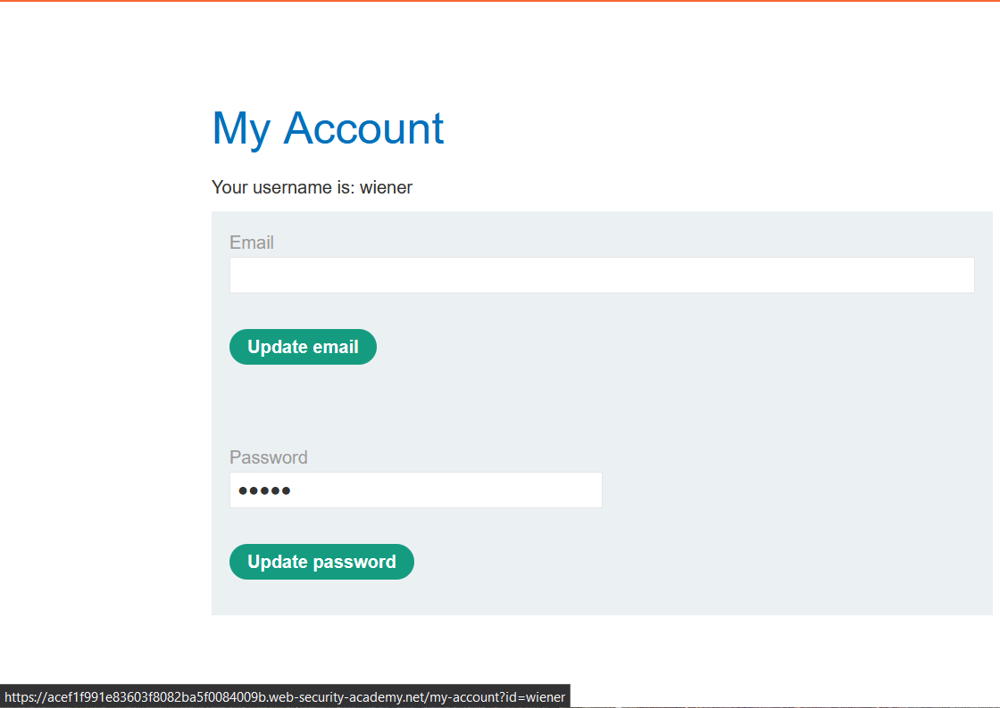
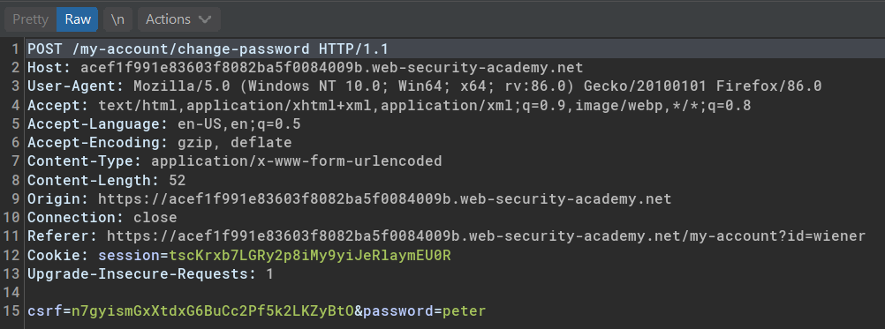
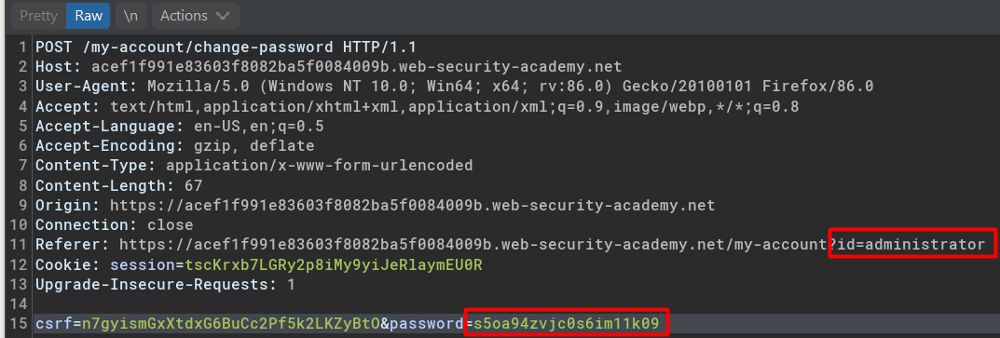

05. Horizontal to vertical privilege escalation  

# Horizontal to vertical privilege escalation

## Lab #9: User ID controlled by request parameter with password disclosure

> This lab has user account page that contains the current user's existing password, prefilled in a masked input.
> 
> To solve the lab, retrieve the administrator's password, then use it to delete `carlos`.
> 
> You can log in to your own account using the following credentials: `wiener:peter `

'My Account' page allows password update.

Intercepting the update password request could capture `wiener`'s unmasked password 

Same goes to the administrator account.

