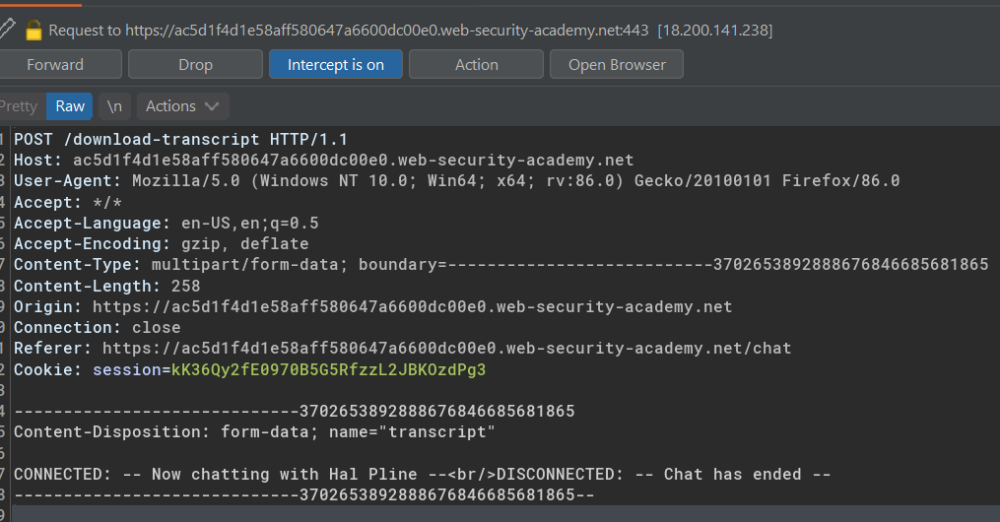
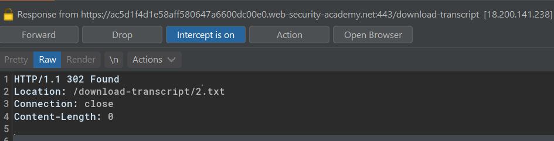
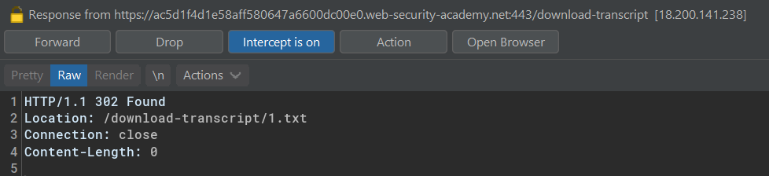
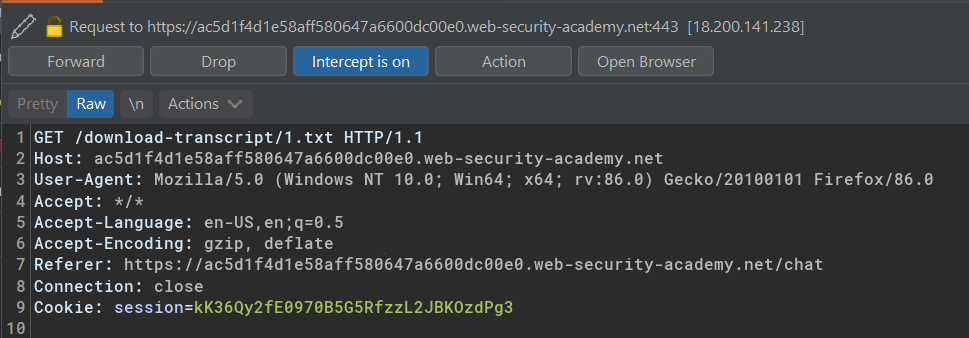
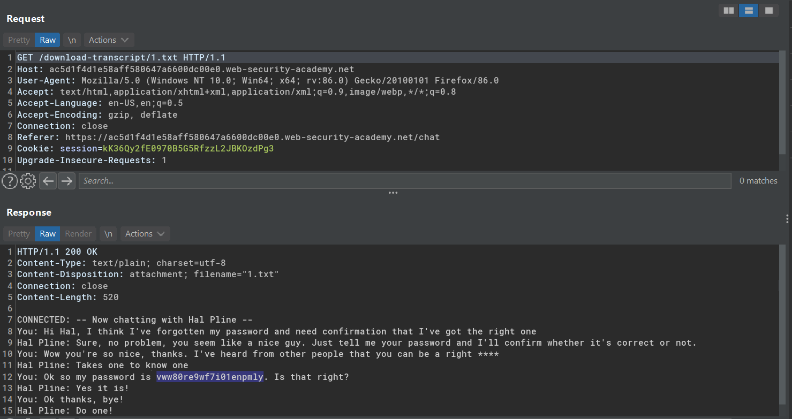

# Insecure direct object references

IDOR arises when an application uses user-supplied input to access objects directly and an attacker can modify the input to obtain unauthorized access

## Lab #10: Insecure direct object references

> This lab stores user chat logs directly on the server's file system, and retrieves them using static URLs.
>
> Solve the lab by finding the password for the user carlos, and logging into their account. 

Requesting chat transcript

It returns 302 Found redirection to a new location of text file.

By modifying the text file name from 2 to 1,

It follows the redirection with the new file name, `1.txt`, in the request url.
 

Discovered a password from chat log 
