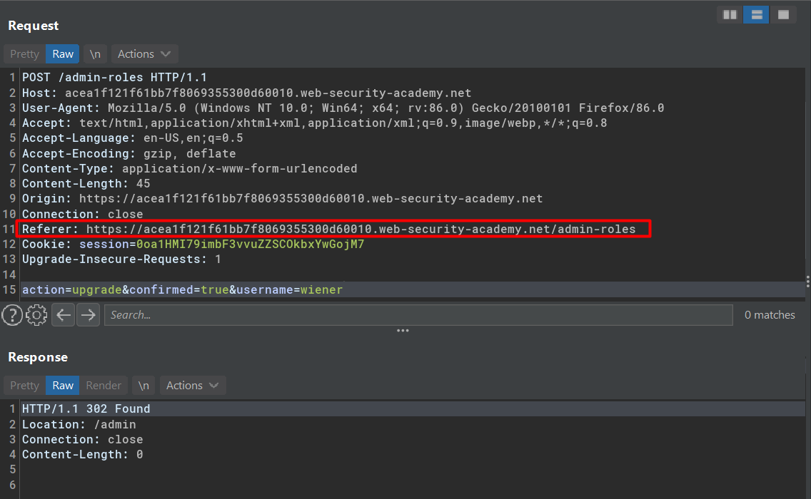

# Access control vulnerabilities in multi-step processes

## Lab #10: Multi-step process with no access control on one step 

> This lab has an admin panel with a flawed multi-step process for changing a user's role. You can familiarize yourself with the admin panel by logging in using the credentials `administrator:admin`.
>
> To solve the lab, log in using the credentials `wiener:peter` and exploit the flawed access controls to promote yourself to become an administrator. 

Observing account ugprade proccess

The initial request:

The second step is a confirmation

The confirmation page view

The new request that being sent after upgrade action is confirmed

By injecting `wiener`'s session to the request above, I successfully become an administrator.

