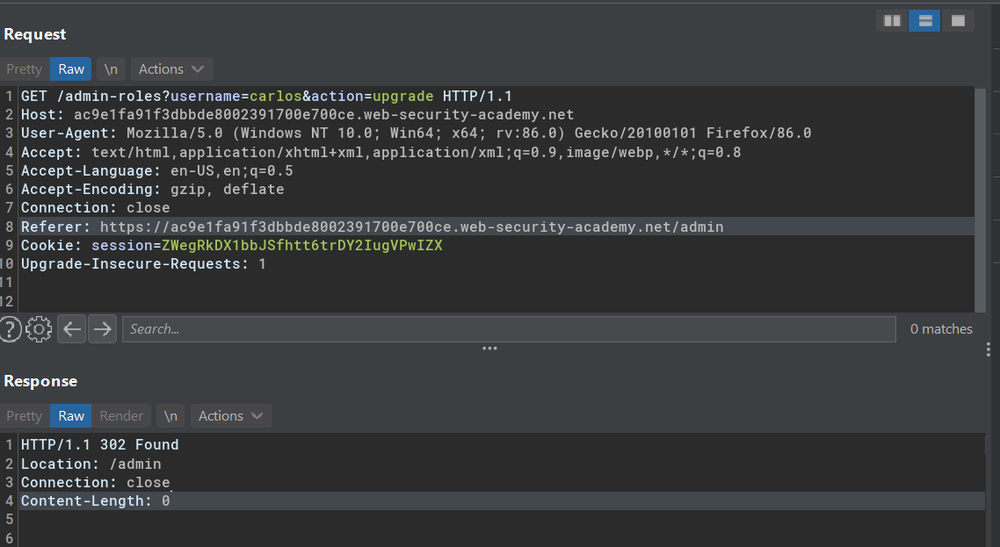
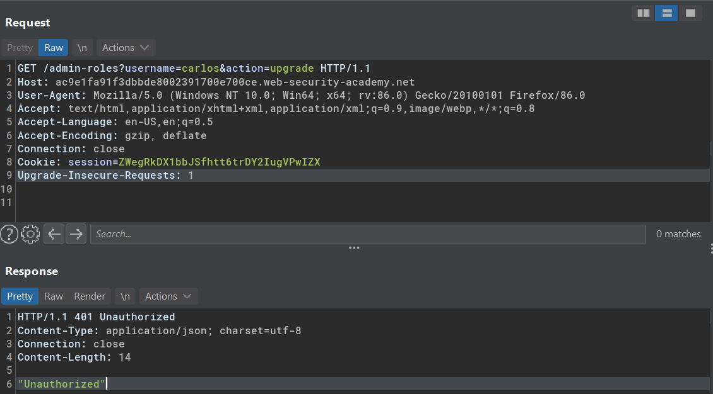
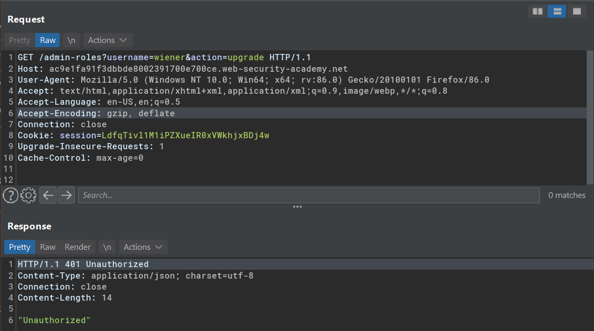
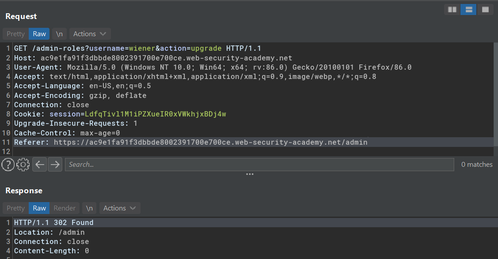
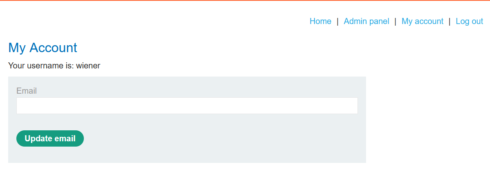

# Referer-based access control 
A referer-based access control is an access control that relies on HTTP `Referer` header. The application then decide whether the specific request/action is allowed or not based on that header.


## Lab #11: Referer-based access control 
> This lab controls access to certain admin functionality based on the Referer header. You can familiarize yourself with the admin panel by logging in using the credentials `administrator:admin`.
> 
> To solve the lab, log in using the credentials `wiener:peter` and exploit the flawed access controls to promote yourself to become an administrator. 

Observing the HTTP request to promote a user to admin from administrator account.


Got unauthorized response after the following header is removed.
```
Referer: https://ac9e1fa91f3dbbde8002391700e700ce.web-security-academy.net/admin
```


Repeating the URL request from `wiener` session also returns unauthorized.



But adding the same referer from admin request resulting a status 302 Found.


Wiener now has admin panel

