# Common SSRF attacks

## Lab #1: Basic SSRF against the local server

> This lab has a stock check feature which fetches data from an internal system.
> 
> To solve the lab, change the stock check URL to access the admin interface at http://localhost/admin and delete the user carlos. 

Observing a product request.

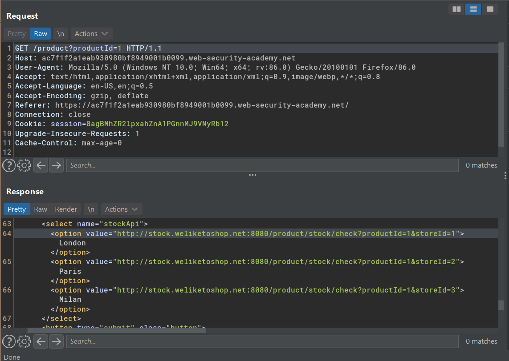

Found an url endpoint to fetch the product stock.

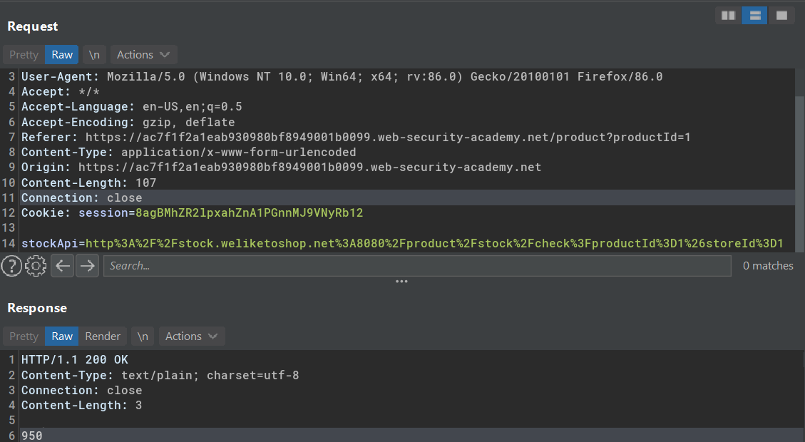

SSRF to `http://localhost`.

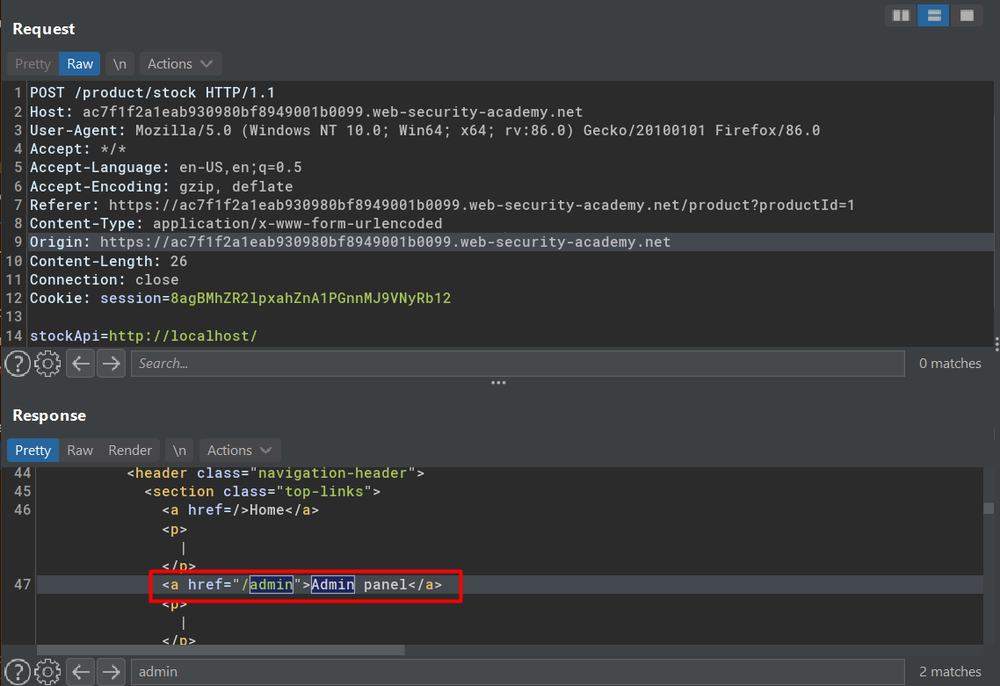

SSRF to `http://localhost/admin`
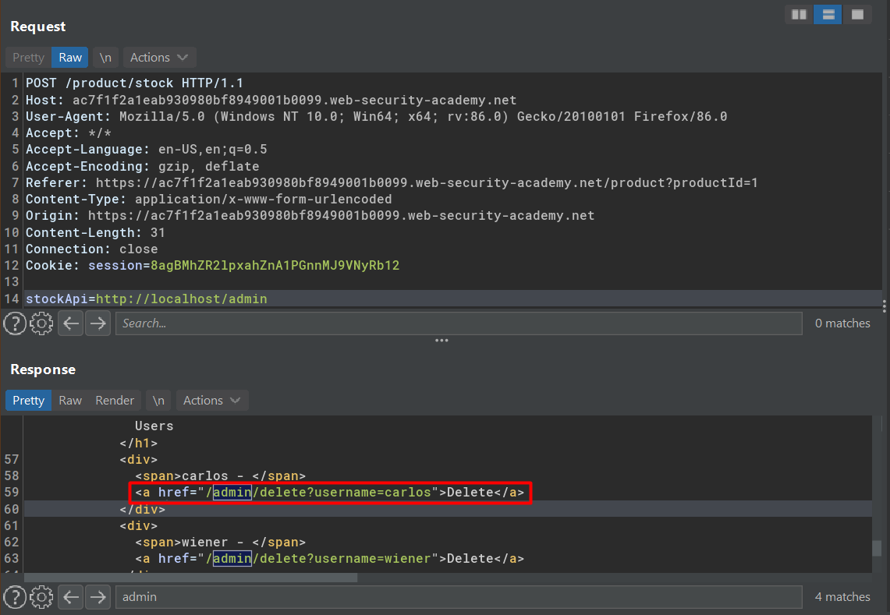

I could make a ssrf to delete user carlos by inserting `http://localhost/admin/delete?username=carlos` as stockApi parameter value.


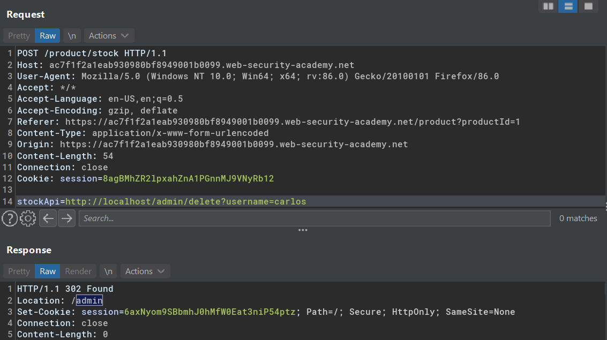

Applications that behave like this have several reason:
1. Access control restriction is ignored since the server connects to itself.
2. Disaster recovery purpose, make it easier to recover even if the administrator lose their credential.

## Lab #2: Basic SSRF against another back-end system

> This lab has a stock check feature which fetches data from an internal system.
> 
> To solve the lab, use the stock check functionality to scan the internal 192.168.0.X range for an admin interface on port 8080, then use it to delete the user carlos. 


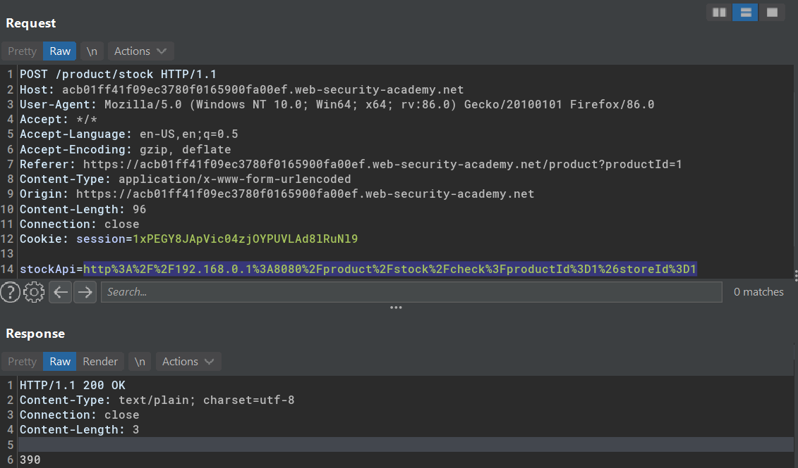

URL encoded
```
http%3A%2F%2F192.168.0.1%3A8080%2Fproduct%2Fstock%2Fcheck%3FproductId%3D1%26storeId%3D1
```

Decoded URL

```
http://192.168.0.1:8080/product/stock/check?productId=1&storeId=1
```

Sending `http://192.168.0.1:8080/admin` returns missing parameter.

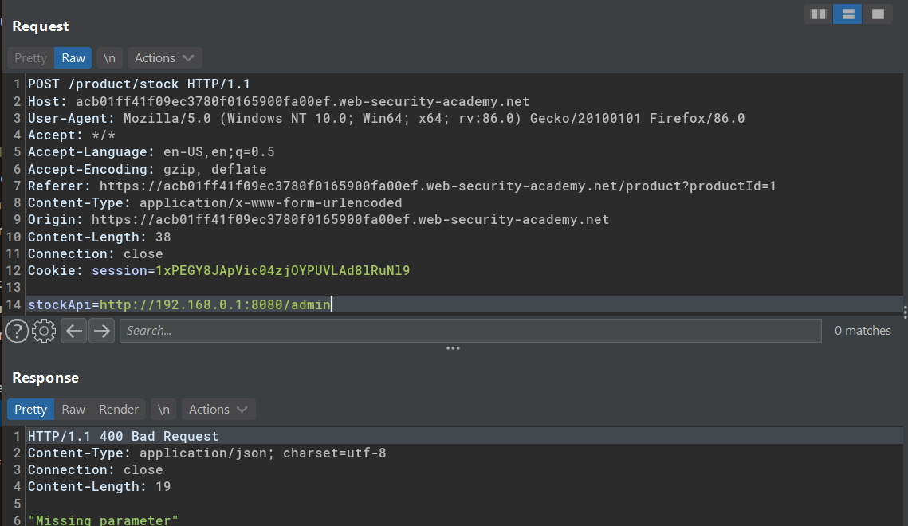


Searching the correct internal IP.

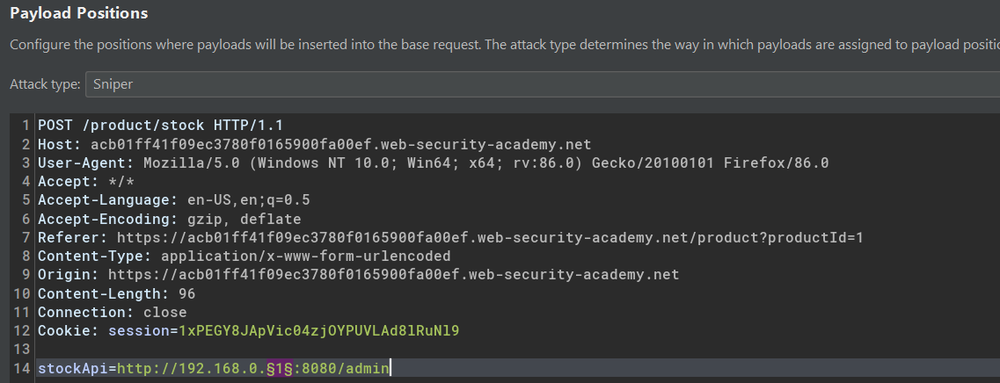

Payload range from 1-255

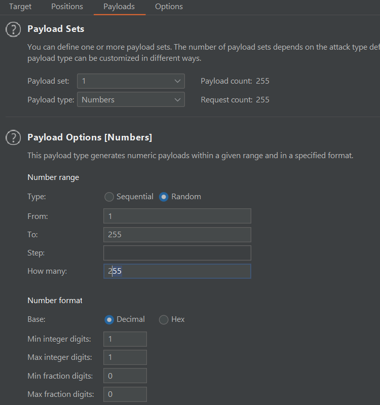


Observe the requests

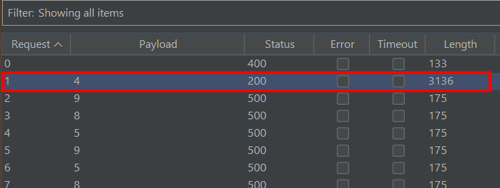

The correct location was `192.168.0.4/admin`

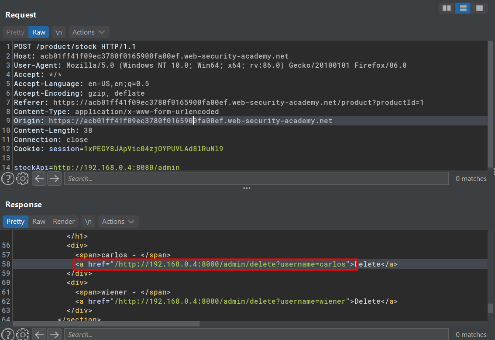

Deleted user `carlos`
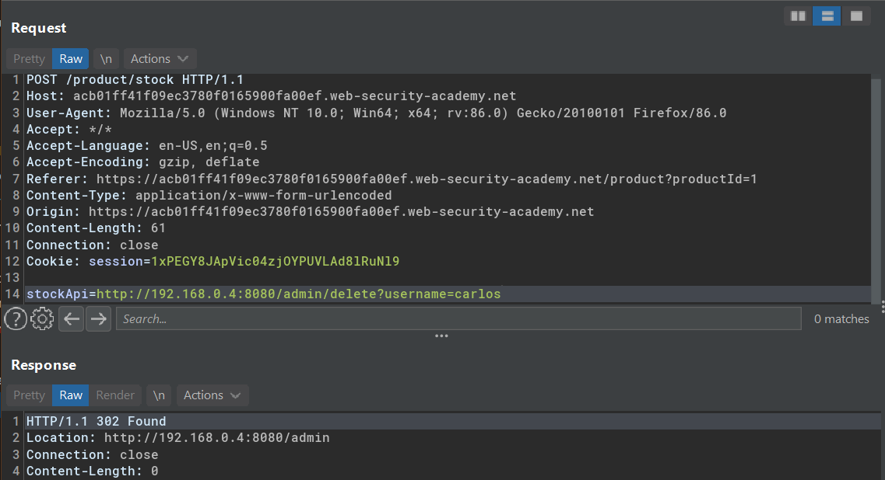