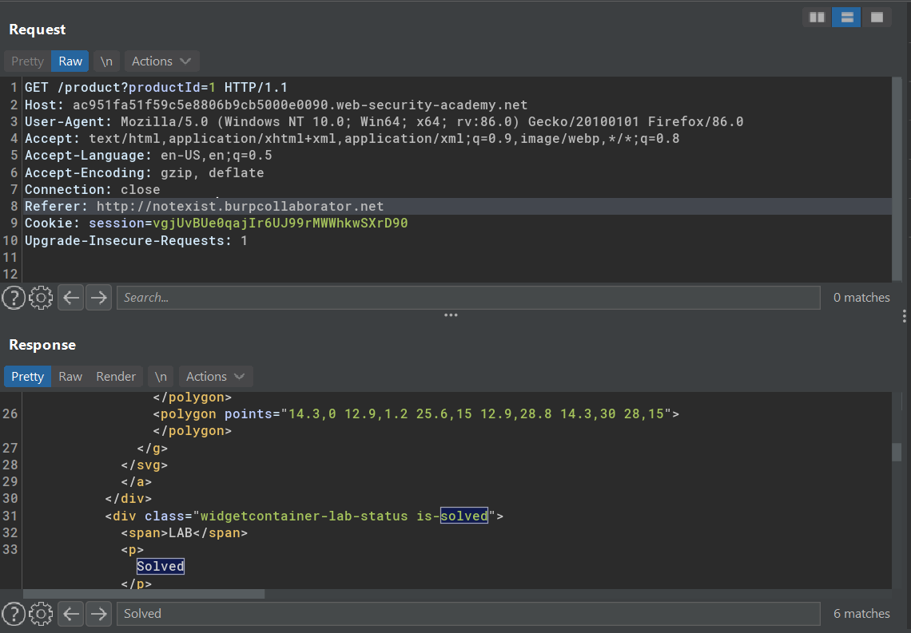

# Blind SSRF vulnerabilities

## Lab #6: Blind SSRF with out-of-band detection

> This site uses analytics software which fetches the URL specified in the Referer header when a product page is loaded.
> 
> To solve the lab, use this functionality to cause an HTTP request to the public Burp Collaborator server. 

Solved in straightforward

